# Application Release

Once you have built your application locally, single-container or multi-container, it is time to put it up on Control Center. This section encapsulates information about how to create Testing Teams, how to add new users to them, and finally, how to add new applications to the control center.

## Deploying Process

Before an application is uploaded, a Testing Team has to be created using the Control Center UI.

A **Testing Team** is a list of users who are allowed access to a new application for testing purposes. Users added to a Testing Team can find the newly added application in their mesh/es **Subscriptions** tab. These users will be able to subscribe to your application and test its various functionalities.

Once you have created your Testing Team, you can upload your application and have your Testing Team test your application thoroughly. Once your private testing is done, you need to email the details of your application (Title, version, partner ID) to Veea.

You might need to add one of Veea’s approval teams to your Testing Team so they can install the application themselves and test it. We will review your application, and if it fits our quality criteria, we will make it available to end-users from Control Center.

## Creating a New Testing Team

This feature will only be available to the **Partner** users.

*   To create a new Testing Team, log into your Control Center account and click on **Applications** in the left-hand side menu.

    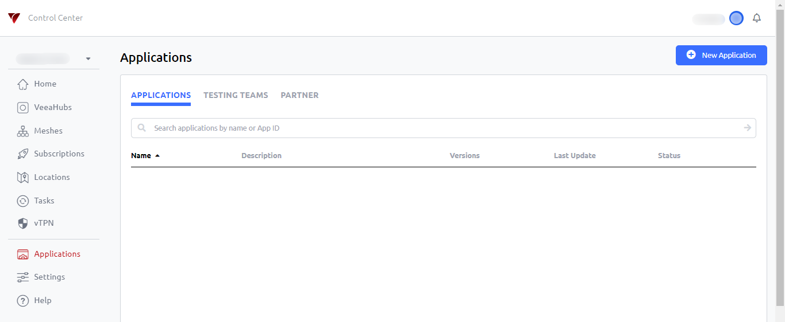
*   Go to **Testing Teams.**

    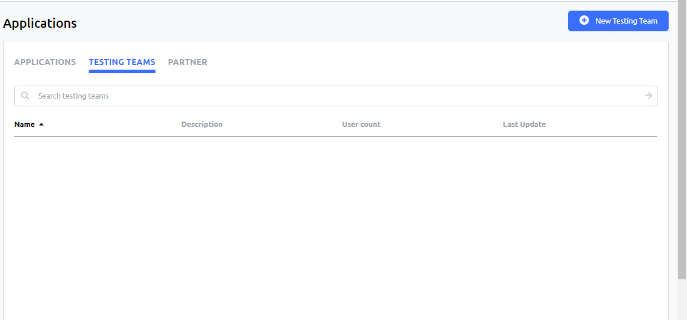
*   Click on the **New Testing Team** button. The New Testing Team popup will appear. Add a name and description for your testing team, then click **Create**.

    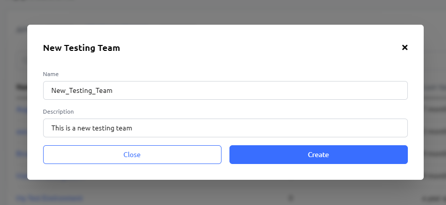
*   You will find your newly created testing team listed on the Testing Teams page.

    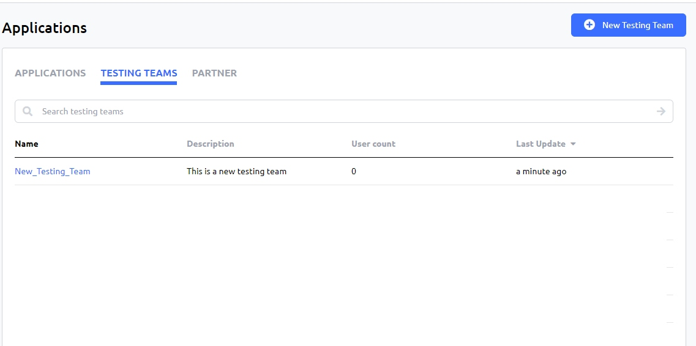
*   Next, click on the newly created testing team and then click on the **Add User** button.

    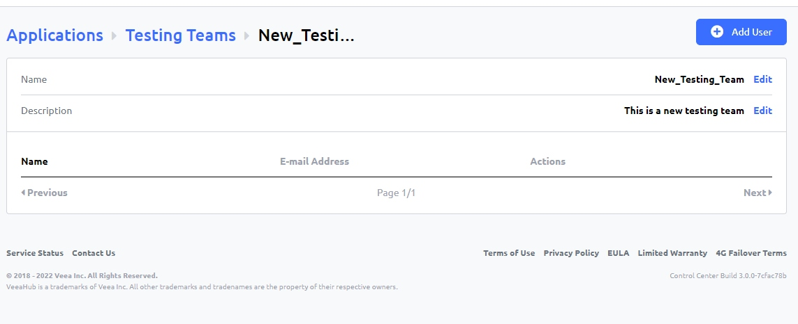
*   In the following popup, search for users to add to your testing team with their email IDs. Once users have been added, close the popup.

    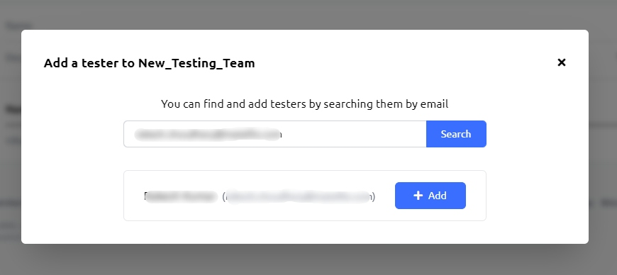
*   New users will be listed on the Testing Teams main page.

    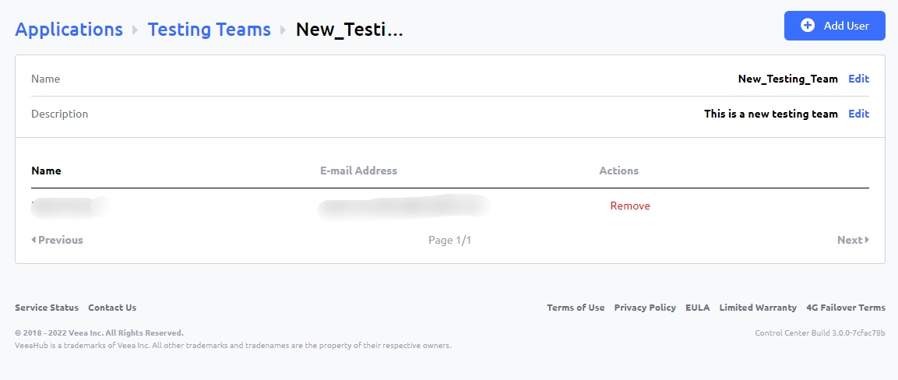

## Adding a New Application

*   The next step in the process is adding your application. To do that, go back to the **Applications** page and click on the **New Application** button.

    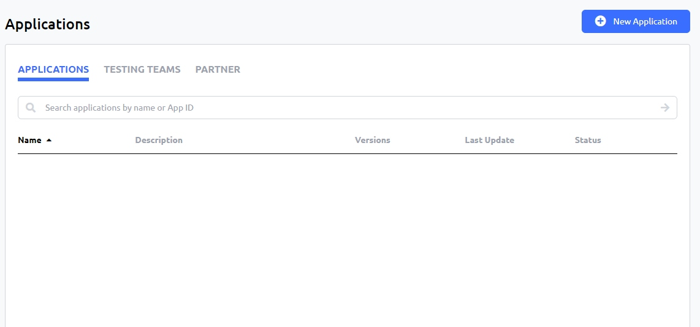
*   You will land on the **New Application** page.

    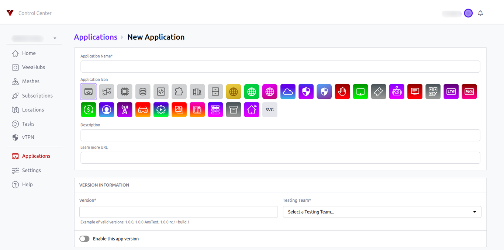
    On this page:
    
    *   Add a name and icon for your application. You can choose any of the pre-loaded icons or upload an SVG for the icon of your choice.
        
    *   Add a description of your application.
        
    *   Add the URL to the site where users can learn more about your application. This URL will be accessible by the users from the Subscriptions page.
        
    *   In the **Version Information** section, add the proper versioning for your app and select the testing team you created above. Make sure that the versioning of your applications is Semantic Versioning compliant.
        
    *   The **Enable this app version** button will list that particular version of the app on the **Subscriptions** page.
        
    *   In the **Features** box, add a list of the features of your application.
        
    *   You can also add a form to your application with JSON schema. You can learn more about JSON schema here or you can click on the **question mark** icon. When you turn on/activate the JSON Schema, the following panel will expand. This panel has three sections: the schema, which is on the left, the form preview, which is on the right, and the form output, which is at the bottom of the section. The purpose of this schema is to add an application form before a user is able to subscribe to your application and collect information from the users, like configuration parameters. Any information that the user adds in this form will be accessible by all the containers of the application. Also, you can make changes to this application form from the code box on the left-hand side and the changes will be reflected immediately.

    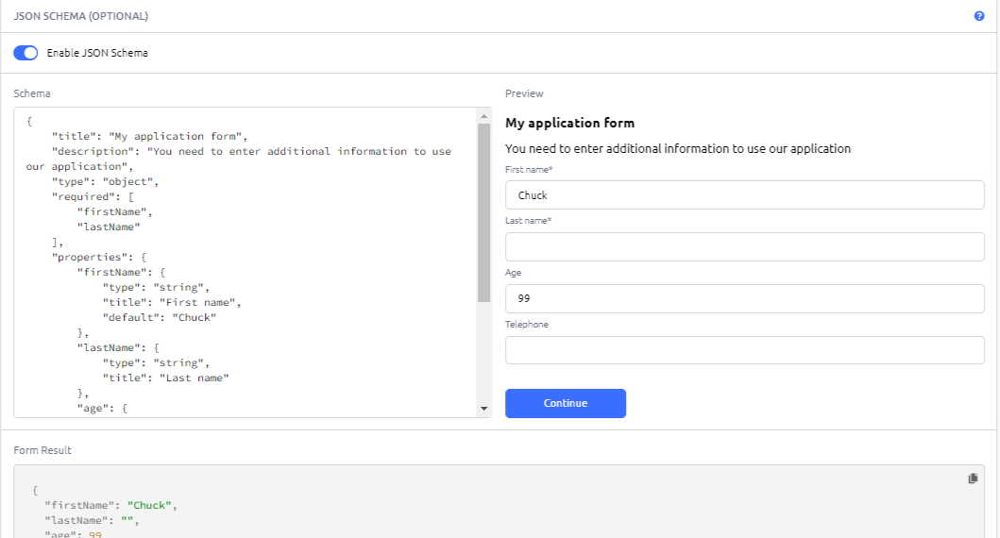
The user information gathered via this form is stored in the `user-config.json` and is present at `/usr/local/config/defaults` directory. The containers of an application will be able to access this location to retrieve user data.

If you wish to view this file, then you will need to add the ssh capability to your container. Once the container is running you can then ssh into it and view this file.

*   Finally, upload the **tgz** file of your application and click on the **Create** button.

    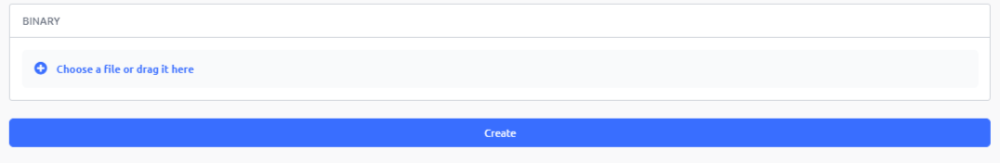
*   Your application will be created and a success message will appear.

    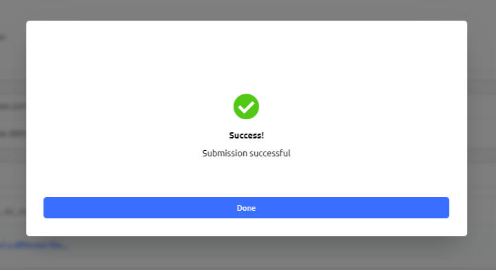
*   The newly created application will be listed on the Applications main page.

    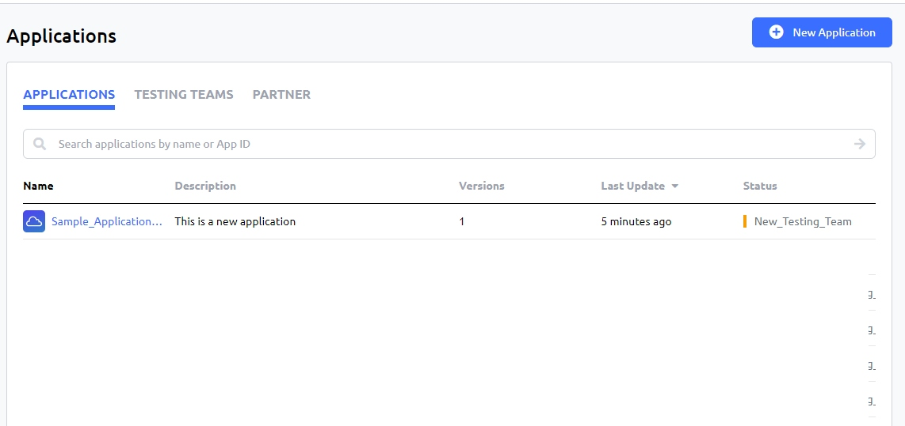
*   The users added to your testing group will then be able to see your application in the Subscriptions popup.

    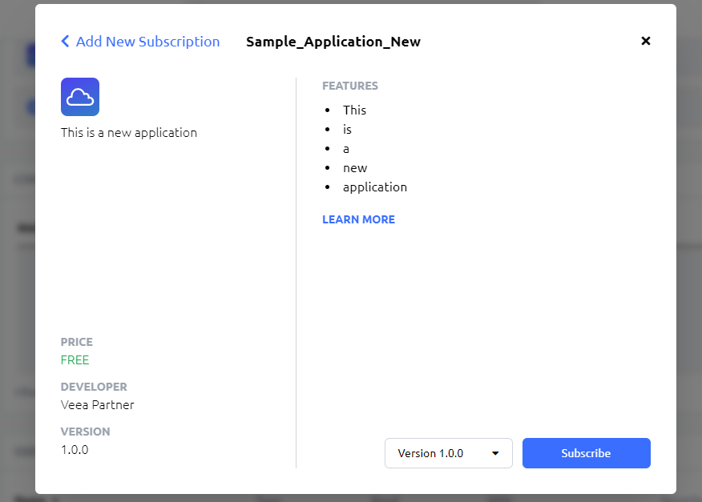

## Editing and Upgrading Applications

*   To edit or upgrade your application, click on it on the Applications page. You will be redirected to the application details page.

    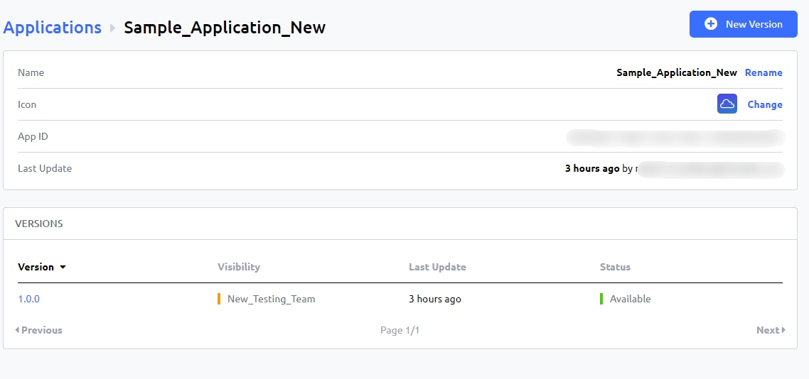
*   Here, you can change the name and icon of the application. Additionally, you can also edit particular versions of your application. You will find all the versions of the application listed in the **Version** section.
    
*   To edit a version from the list, click on it. You will be redirected to the edit version page where you can make the necessary tweaks.

    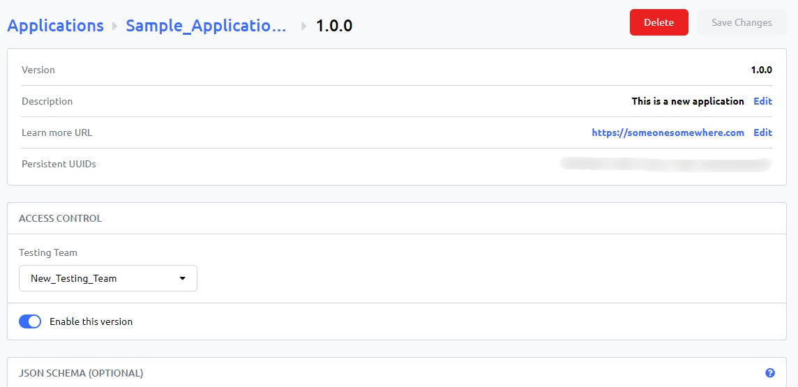
!!! warning
    You can’t change the version number and the binary file of a version.

To delete an application, you will have to delete all of its versions individually. Once you delete the last version in the **Versions** section, the application will be deleted from the **Applications** page as well.

*   To upgrade an application, you will have to add a new version of the application. Click on the **New Version** button on the application details page.

    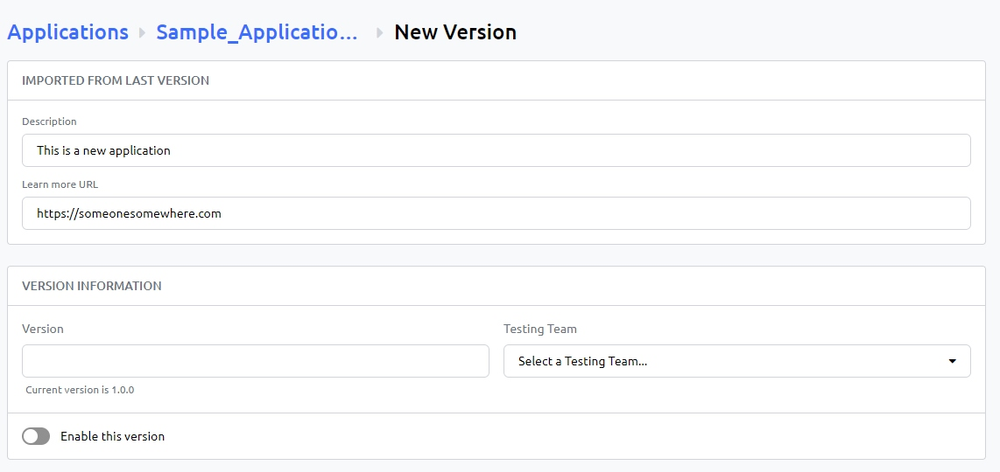
*   On the New Version page, add all the details of the new version of the application and then upload the new **tgz** file. Once done, click on the **Create new version** button.
    
*   The version will be created and listed in the version section of the application details page.

    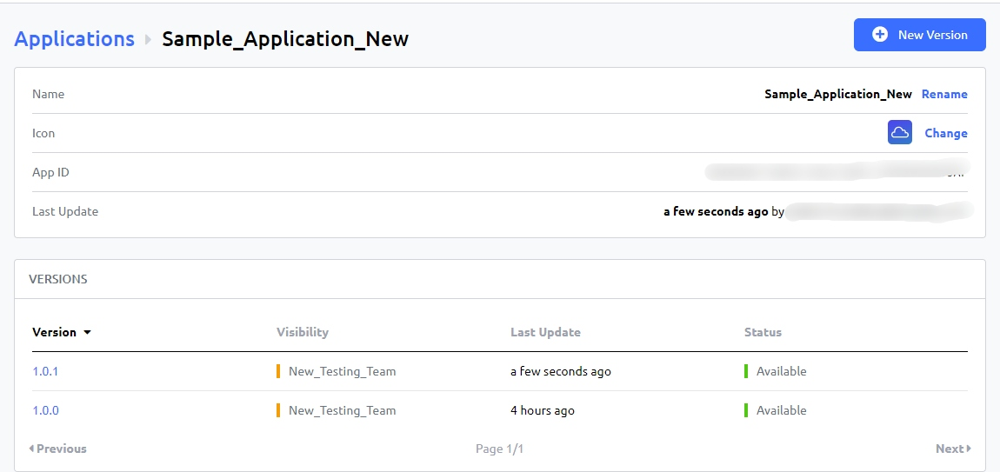
*   If you enabled the new version of the application while creating it, users will see it in the version dropdown on the Subscriptions popup.

    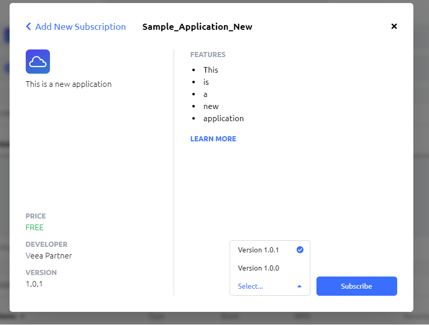
