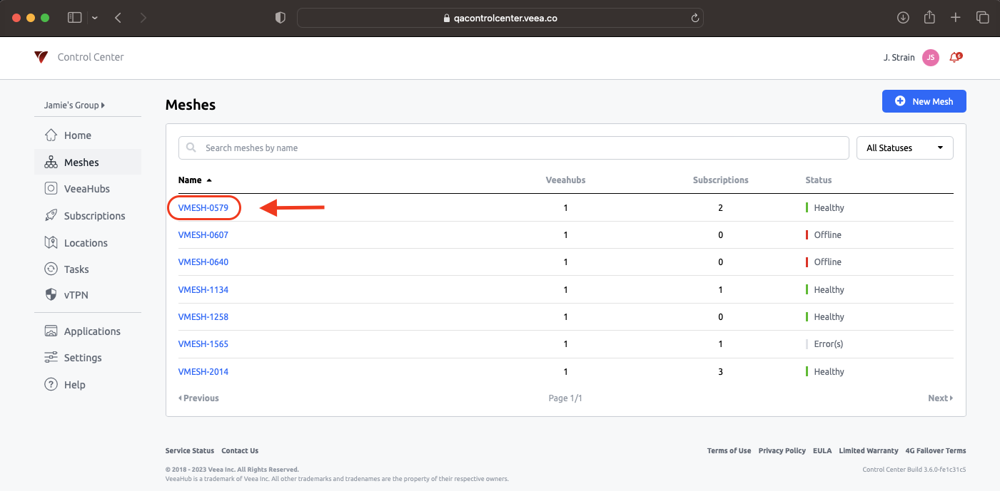
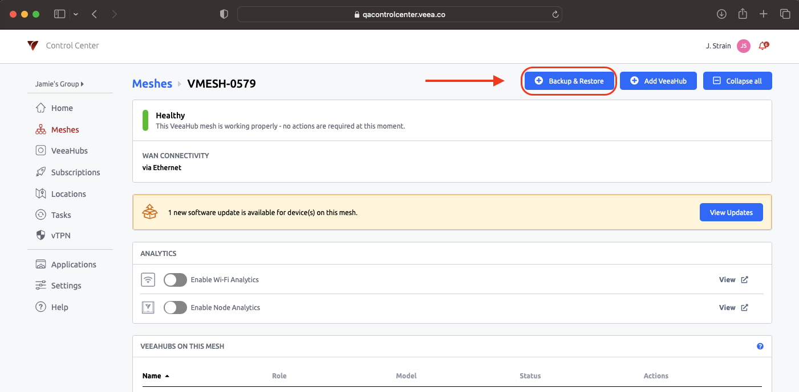
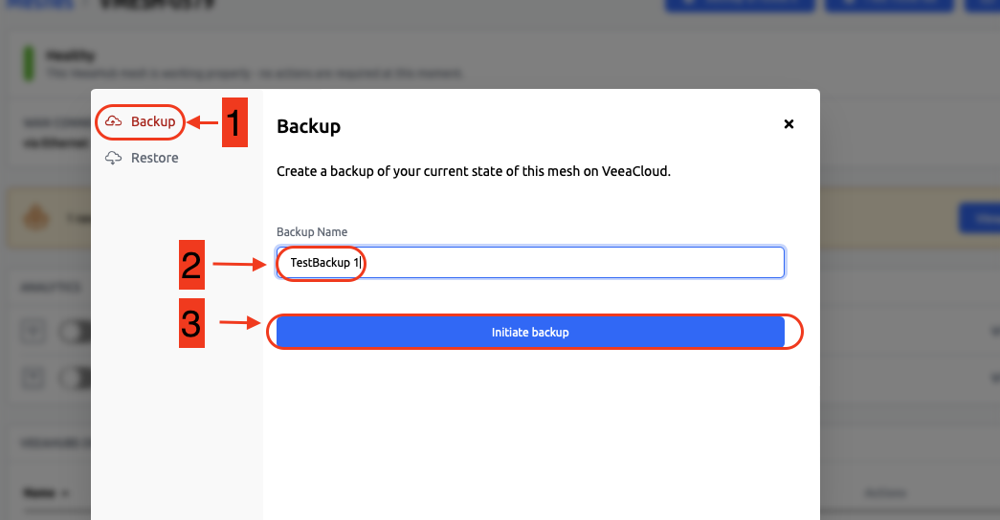
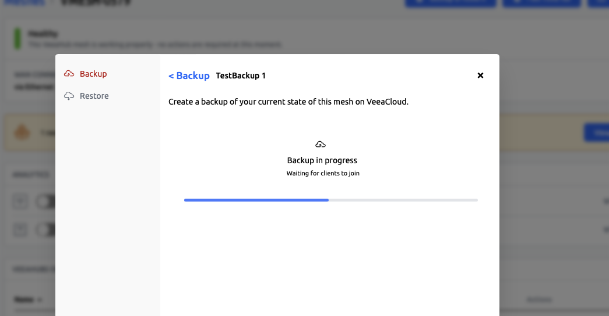
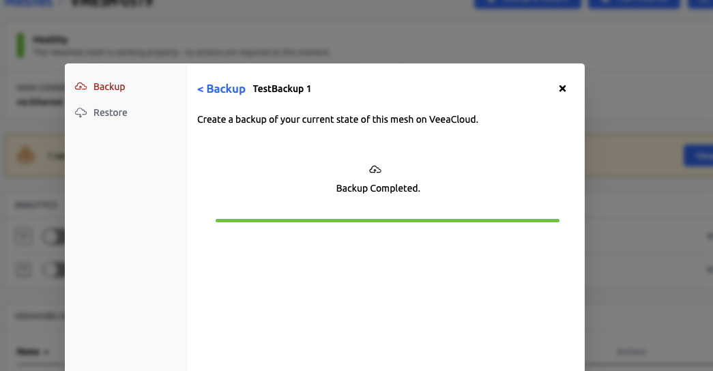
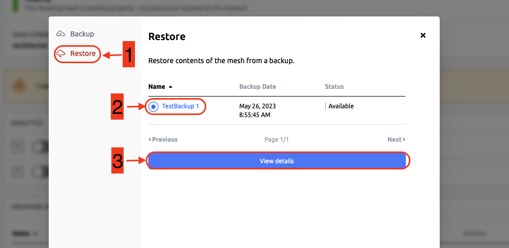
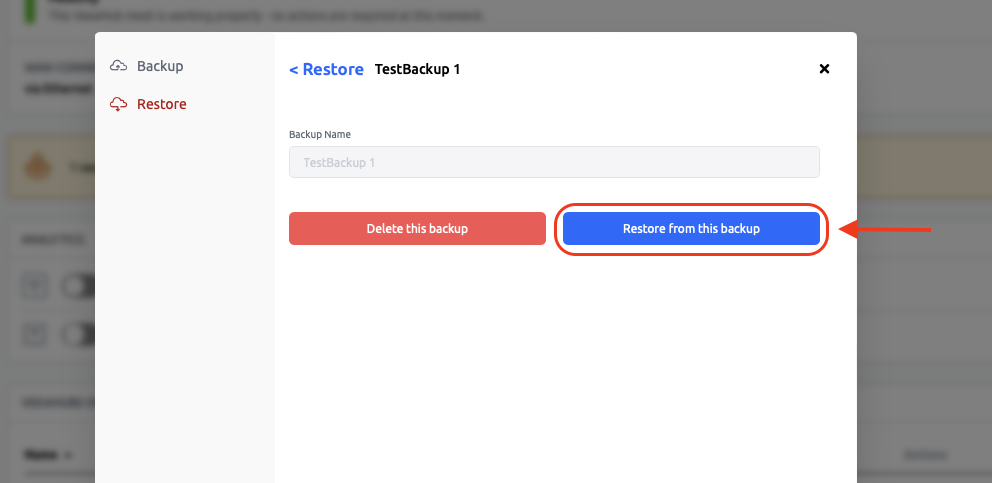
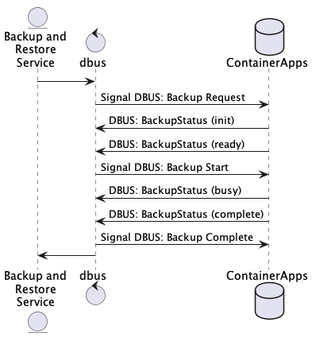
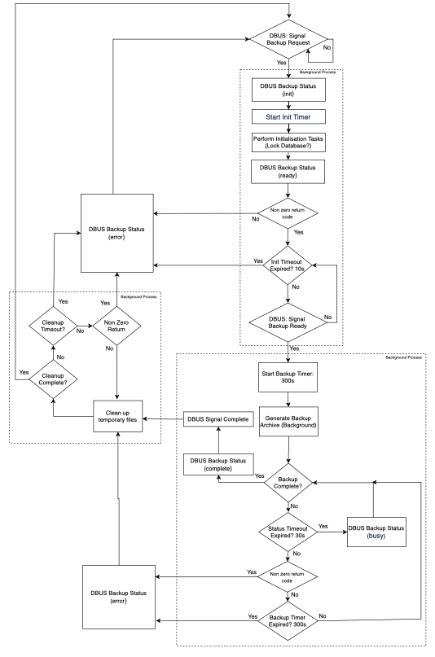
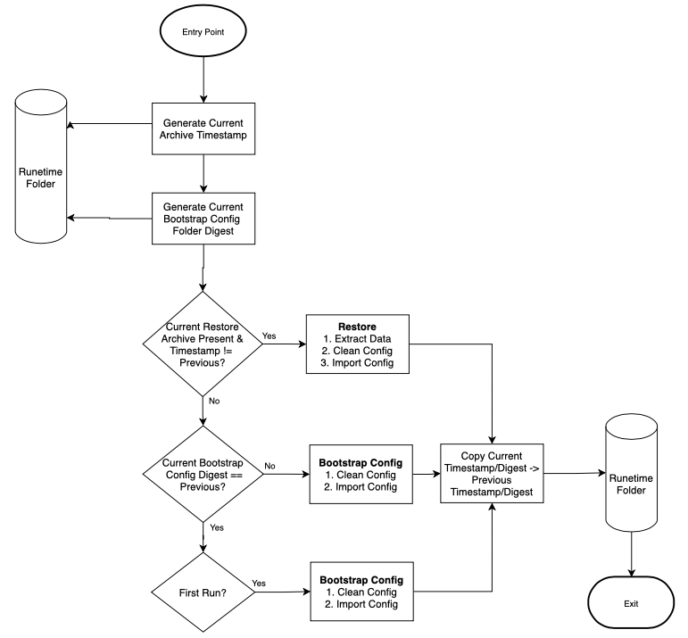

# An Example to Demonstrate Container Backup and Restore

This tutorial demonstrates container backup/restore using the template `vh_postgres_backup_restore`.

!!! info
    In this tutorial you will learn:

    *   How to build/run container backup and restore

    *   How to do a container backup/restore using Veea Control Center

    *   How backup and restore works.
    

## Creating

The first step is to create an instance of the `vh_postgres_backup_restore` template.

```console
$ vhc image create template vh_postgres_backup_restore
Creating image directory vh_postgres_backup_restore
Downloaded vh_postgres_backup_restore.zip
Unzipped vh_postgres_backup_restore.zip into vh_postgres_backup_restore
```

You can enter the new directory and list the contents.

```console
$ cd vh_postgres_backup_restore
$ ls
config config.yaml  Dockerfile  README.md  src
```

## Configuring

No configuration of this template is necessary.

## Building

```console
$ vhc image build save --arch arm64v8
Saving arm64v8
Generating: /home/jstrain/veea/vht/vh_apps_newway/vh_app_postgres_backup_restore/vh_postgres_backup_restore/build/auth/Dockerfile
/home/jstrain/veea/vht/vh_apps_newway/vh_app_postgres_backup_restore/vh_postgres_backup_restore/build/auth/Dockerfile is newer than the vh_postgresql_backup_restore-arm64v8:1.0.0 docker image.
Compiling image: vh_postgresql_backup_restore arm64v8
Pruning previous instance of the same image
docker build  --build-arg ARCH=arm64v8 -t vh_postgresql_backup_restore-arm64v8:1.0.0 -f /home/jstrain/veea/vht/vh_apps_newway/vh_app_postgres_backup_restore/vh_postgres_backup_restore/build/auth/Dockerfile /home/jstrain/veea/vht/vh_apps_newway/vh_app_postgres_backup_restore/vh_postgres_backup_restore
Sending build context to Docker daemon  80.86MB
Step 1/28 : ARG ARCH
Step 2/28 : FROM $ARCH/alpine:3.9
 ---> 9afdd4a290bf
Step 3/28 : RUN apk add --no-cache postgresql postgresql-contrib dbus
 ---> [Warning] The requested image's platform (linux/arm64) does not match the detected host platform (linux/amd64) and no specific platform was requested
 ---> Running in ff19d317f0de
fetch http://dl-cdn.alpinelinux.org/alpine/v3.9/main/aarch64/APKINDEX.tar.gz
fetch http://dl-cdn.alpinelinux.org/alpine/v3.9/community/aarch64/APKINDEX.tar.gz
(1/17) Installing dbus-libs (1.10.28-r1)
(2/17) Installing expat (2.2.8-r0)
(3/17) Installing dbus (1.10.28-r1)
Executing dbus-1.10.28-r1.pre-install
Executing dbus-1.10.28-r1.post-install
(4/17) Installing ncurses-terminfo-base (6.1_p20190105-r0)
(5/17) Installing ncurses-terminfo (6.1_p20190105-r0)
(6/17) Installing ncurses-libs (6.1_p20190105-r0)
(7/17) Installing libedit (20181209.3.1-r0)
(8/17) Installing db (5.3.28-r1)
(9/17) Installing libsasl (2.1.27-r2)
(10/17) Installing libldap (2.4.48-r2)
(11/17) Installing libpq (11.11-r0)
(12/17) Installing postgresql-client (11.11-r0)
(13/17) Installing tzdata (2020c-r1)
(14/17) Installing libxml2 (2.9.9-r3)
(15/17) Installing postgresql (11.11-r0)
(16/17) Installing libuuid (2.33-r0)
(17/17) Installing postgresql-contrib (11.11-r0)
Executing busybox-1.29.3-r10.trigger
OK: 38 MiB in 31 packages
Removing intermediate container ff19d317f0de
 ---> bab8c4c77fac
Step 4/28 : WORKDIR /app
 ---> [Warning] The requested image's platform (linux/arm64) does not match the detected host platform (linux/amd64) and no specific platform was requested
 ---> Running in 16eeab9907ec
Removing intermediate container 16eeab9907ec
 ---> 8d83d53c29ae
Step 5/28 : COPY src/ /app/
 ---> 04b9967c68f8
Step 6/28 : RUN chmod -R 777 /app /run && 	mkdir -p /run/veea_backup_restore/ && 	chmod o+rwx /run/veea_backup_restore/
 ---> [Warning] The requested image's platform (linux/arm64) does not match the detected host platform (linux/amd64) and no specific platform was requested
 ---> Running in bbfc2d706219
Removing intermediate container bbfc2d706219
 ---> 94e56fb39eb5
Step 7/28 : ENV POSTGRES_USER=postgres 	DB_DIR=/var/lib/veea/postgresqldata 	UNIX_DOMAIN_SOCKET_DIR=/app/data/unix-domain-socket 	PGRUN=/run
 ---> [Warning] The requested image's platform (linux/arm64) does not match the detected host platform (linux/amd64) and no specific platform was requested
 ---> Running in e5796c995bd4
Removing intermediate container e5796c995bd4
 ---> 09951dcc9a5a
Step 8/28 : ENV	PGHOST ${UNIX_DOMAIN_SOCKET_DIR}
 ---> [Warning] The requested image's platform (linux/arm64) does not match the detected host platform (linux/amd64) and no specific platform was requested
 ---> Running in 2b49013bd098
Removing intermediate container 2b49013bd098
 ---> 61a3ec9eba29
Step 9/28 : ARG name="vh_postgresql_backup_restore"
 ---> [Warning] The requested image's platform (linux/arm64) does not match the detected host platform (linux/amd64) and no specific platform was requested
 ---> Running in fe61c506b7e5
Removing intermediate container fe61c506b7e5
 ---> cc84c54bdde1
Step 10/28 : ARG version="1.0.0"
 ---> [Warning] The requested image's platform (linux/arm64) does not match the detected host platform (linux/amd64) and no specific platform was requested
 ---> Running in ac6c9302ec51
Removing intermediate container ac6c9302ec51
 ---> 88b5f82a674c
Step 11/28 : LABEL com.veea.image.name=$name
 ---> [Warning] The requested image's platform (linux/arm64) does not match the detected host platform (linux/amd64) and no specific platform was requested
 ---> Running in b9c3973e1b48
Removing intermediate container b9c3973e1b48
 ---> 6451739e66d1
Step 12/28 : LABEL com.veea.image.tag=$version
 ---> [Warning] The requested image's platform (linux/arm64) does not match the detected host platform (linux/amd64) and no specific platform was requested
 ---> Running in b227531ef246
Removing intermediate container b227531ef246
 ---> 597677237b4f
Step 13/28 : ARG ARCH
 ---> [Warning] The requested image's platform (linux/arm64) does not match the detected host platform (linux/amd64) and no specific platform was requested
 ---> Running in 4a54393ed7cb
Removing intermediate container 4a54393ed7cb
 ---> 7d45aa3f9c35
Step 14/28 : LABEL com.veea.vhc.architecture="$ARCH"
 ---> [Warning] The requested image's platform (linux/arm64) does not match the detected host platform (linux/amd64) and no specific platform was requested
 ---> Running in 1dace605b76c
Removing intermediate container 1dace605b76c
 ---> 1d7e81fdaa77
Step 15/28 : LABEL com.veea.vhc.version="0.9.3-38-dirty"
 ---> [Warning] The requested image's platform (linux/arm64) does not match the detected host platform (linux/amd64) and no specific platform was requested
 ---> Running in 2caa11a0c3d9
Removing intermediate container 2caa11a0c3d9
 ---> 73bedeee915d
Step 16/28 : LABEL com.veea.vhc.app.name="vh_postgresql_backup_restore"
 ---> [Warning] The requested image's platform (linux/arm64) does not match the detected host platform (linux/amd64) and no specific platform was requested
 ---> Running in 724fe3073fca
Removing intermediate container 724fe3073fca
 ---> d7cf2808a364
Step 17/28 : LABEL com.veea.vhc.app.version="1.0.0"
 ---> [Warning] The requested image's platform (linux/arm64) does not match the detected host platform (linux/amd64) and no specific platform was requested
 ---> Running in 5b68073c9328
Removing intermediate container 5b68073c9328
 ---> d2b87a1f3b31
Step 18/28 : LABEL com.veea.vhc.config.proj.version="3"
 ---> [Warning] The requested image's platform (linux/arm64) does not match the detected host platform (linux/amd64) and no specific platform was requested
 ---> Running in 4ee0d51b66fb
Removing intermediate container 4ee0d51b66fb
 ---> 3641ddae0416
Step 19/28 : LABEL com.veea.vhc.config.user.version="3"
 ---> [Warning] The requested image's platform (linux/arm64) does not match the detected host platform (linux/amd64) and no specific platform was requested
 ---> Running in 023aff15565b
Removing intermediate container 023aff15565b
 ---> 15dcb74e01d2
Step 20/28 : LABEL com.veea.authentication.identifier="PARTNER;0000000D;1632209644,1947569644;79E/jb0cEwOekGlfRD+M6YXgGLkuHaeeklX2nN5QeGo=;sha256;veeahub_license_server;MEYCIQDWL5lXKhNaYnIClus0rzTAr2s7CAWimspDjO/qq1hKBwIhAItYRwS7FaYt1UW3tI4PLSf4gGZ98yCLERPKzYukD1Gj"
 ---> [Warning] The requested image's platform (linux/arm64) does not match the detected host platform (linux/amd64) and no specific platform was requested
 ---> Running in f12597341dc0
Removing intermediate container f12597341dc0
 ---> 9779528b425a
Step 21/28 : LABEL com.veea.image.persistent_uuid="0000000D-AF27-41AA-B6E4-9FA2F4AE2280"
 ---> [Warning] The requested image's platform (linux/arm64) does not match the detected host platform (linux/amd64) and no specific platform was requested
 ---> Running in 8774addcfde1
Removing intermediate container 8774addcfde1
 ---> d6fad3740d4d
Step 22/28 : LABEL com.veea.authorisation.allowOnUnauthenticatedHost="true"
 ---> [Warning] The requested image's platform (linux/arm64) does not match the detected host platform (linux/amd64) and no specific platform was requested
 ---> Running in a7e5986a4f36
Removing intermediate container a7e5986a4f36
 ---> e7622db4e4d3
Step 23/28 : LABEL com.veea.authorisation.volumes.persist1="postgresqldata"
 ---> [Warning] The requested image's platform (linux/arm64) does not match the detected host platform (linux/amd64) and no specific platform was requested
 ---> Running in 01d2b68971cd
Removing intermediate container 01d2b68971cd
 ---> cba510541c72
Step 24/28 : LABEL com.veea.authorisation.volumes.persist2="postgresqllog"
 ---> [Warning] The requested image's platform (linux/arm64) does not match the detected host platform (linux/amd64) and no specific platform was requested
 ---> Running in d6246fcf27cb
Removing intermediate container d6246fcf27cb
 ---> 4f70ec2c460b
Step 25/28 : LABEL com.veea.authentication.certificates.partner="MIICHDCCAcKgAwIBAgIJAL3vKQdknJVtMAoGCCqGSM49BAMCMEcxETAPBgNVBAoMCFZlZWEgSW5jMTIwMAYDVQQDDClWZWVhIFBhcnRuZXIgMDAwMDAwMEQgU2lnbmluZyBDZXJ0aWZpY2F0ZTAeFw0yMTA5MjEwNzM0MDRaFw0zMTA5MTkwNzM0MDRaMEcxETAPBgNVBAoMCFZlZWEgSW5jMTIwMAYDVQQDDClWZWVhIFBhcnRuZXIgMDAwMDAwMEQgU2lnbmluZyBDZXJ0aWZpY2F0ZTBZMBMGByqGSM49AgEGCCqGSM49AwEHA0IABIjA9Lqlw+2BF7kfUa0bjs2ucITEH7DkbGECXL6m57iFmYb8WE8N4H/X5tahNb8ivq1oCQqoD81vZC9k6Ar8g3WjgZYwgZMwYQYDVR0jBFowWKFLpEkwRzERMA8GA1UECgwIVmVlYSBJbmMxMjAwBgNVBAMMKVZlZWEgUGFydG5lciAwMDAwMDAwRCBTaWduaW5nIENlcnRpZmljYXRlggkAve8pB2SclW0wHQYDVR0OBBYEFF6xVNAwqerRl3eiml1vTEF6wOKpMA8GA1UdEwEB/wQFMAMBAf8wCgYIKoZIzj0EAwIDSAAwRQIhAI9kBqOFcb+iZdhJ4MNQGZmVVuv/fZ55V5hGtv7pkmiqAiBnMiON8hHyEvO47ElB9m/wFLucCC7aHddzMw37R4Ex3w=="
 ---> [Warning] The requested image's platform (linux/arm64) does not match the detected host platform (linux/amd64) and no specific platform was requested
 ---> Running in 88659ee04c72
Removing intermediate container 88659ee04c72
 ---> 7df631b5c57e
Step 26/28 : LABEL com.veea.authentication.certificates.veeahub_license_server="MIIB0jCCATSgAwIBAgIBATAKBggqhkjOPQQDAjBAMREwDwYDVQQKDAhWZWVhIEluYzEfMB0GA1UEAwwWVmVlYSBMaWNlbnNlIEF1dGhvcml0eTEKMAgGA1UELAwBMDAeFw0xODEyMDcxODE3NTlaFw0zMzEyMDMxODE3NTlaMEIxETAPBgNVBAoMCFZlZWEgSW5jMSEwHwYDVQQDDBhWZWVhIE1haW4gTGljZW5zZSBTZXJ2ZXIxCjAIBgNVBCwMATAwWTATBgcqhkjOPQIBBggqhkjOPQMBBwNCAAQqVnzlrPYomV3ZRVZaGxRv4xJPhKnkNa+PALfw8Xc/MemlcoLZmAKWWNRPjIyW2sOlYKr0+FpGIvZVZ4u/6iAFox0wGzAMBgNVHRMBAf8EAjAAMAsGA1UdDwQEAwICtDAKBggqhkjOPQQDAgOBiwAwgYcCQgCXFl2jBWtVp7H6ELCxLUs0tl4wFycLW4ANoKErrTcmv8TxlcsD0lUq6iBPQAmtlUW00QeVwNG2Ffavvli6Cvq+0AJBT8R4+UMqL6PKs2Dle3S6LwyEjmtAYwLv685LwPOTMzR4FiQoUmT1DVnR9rjudO18p5Uqzufwr3SABYv0FFtpVvM="
 ---> [Warning] The requested image's platform (linux/arm64) does not match the detected host platform (linux/amd64) and no specific platform was requested
 ---> Running in 3d945cefd1c6
Removing intermediate container 3d945cefd1c6
 ---> 8a878c02ccfe
Step 27/28 : LABEL com.veea.authentication.certificates.veeahub_license_authority="MIICJDCCAYagAwIBAgIBBDAKBggqhkjOPQQDAjBLMQowCAYDVQQsDAEwMREwDwYDVQQKDAhWZWVhIEluYzEMMAoGA1UECwwDUEtJMRwwGgYDVQQDDBNWZWVhIFJvb3QgQXV0aG9yaXR5MB4XDTE4MTIwNzE4MTI1NVoXDTM4MTIwMjE4MTI1NVowQDERMA8GA1UECgwIVmVlYSBJbmMxHzAdBgNVBAMMFlZlZWEgTGljZW5zZSBBdXRob3JpdHkxCjAIBgNVBCwMATAwgZswEAYHKoZIzj0CAQYFK4EEACMDgYYABAE2fGY0fpdvS1moPN/3iTc5F9mTnEYtFeyj325dNpcT9OJPfYx/ORV0dMXY7OLXN87+0pR0a6gOnIAj5Ozlw0xBoQAyuPxDdmWKVAzg9g2+d01JqDQRyHUZdDzdtlGMh0JRvX2RHgtB+3jVvMVmzNdxmjJP0lsoJC26Io3K4WKjB+wNz6MjMCEwEgYDVR0TAQH/BAgwBgEB/wIBADALBgNVHQ8EBAMCAoQwCgYIKoZIzj0EAwIDgYsAMIGHAkEWk3a6EgOknqIQbDSoIGtczfq7LNmPegHyKg7WEodpT0PnRhB/pXctWOPA3k0i1BSuPCCa+5mKGhjTxDaUVbNNUwJCAYHfHkIaEkMeceloA7NmB85XBY6+ftnBEumzPth5C5QQ3RyoU4ktZ8A8PYjDbGGYD8l7V5Jl5yUd1w7Nl7Budqyf"
 ---> [Warning] The requested image's platform (linux/arm64) does not match the detected host platform (linux/amd64) and no specific platform was requested
 ---> Running in de7d85647d8c
Removing intermediate container de7d85647d8c
 ---> 95e1926240f2
Step 28/28 : CMD ["/app/start.sh"]
 ---> [Warning] The requested image's platform (linux/arm64) does not match the detected host platform (linux/amd64) and no specific platform was requested
 ---> Running in a996c91da67f
Removing intermediate container a996c91da67f
 ---> e235303b0176
Successfully built e235303b0176
Successfully tagged vh_postgresql_backup_restore-arm64v8:1.0.0
Saving: vh_postgresql_backup_restore arm64v8
  Writing vh_postgresql_backup_restore-arm64v8:1.0.0.unsigned.tar
```

## Running

### Upload the Image

```console
$ vhc hub access upload-image vh_postgres_backup_restore/build/auth/arm64v8/vh_postgresql_backup_restore-arm64v8\:1.0.0.signed.tar
Creating image push for file [vh_postgres_backup_restore/build/auth/arm64v8/vh_postgresql_backup_restore-arm64v8:1.0.0.signed.tar] on E09BCW00C0B000000579:9000 (images/push)...
############################################################################################################################################################################################################################ 100.0%
{"image_id": "2053033e3e366a0a17ab345cc060b1d04aa71a9ac4ec474cb113ef0921cf63e5"}
```

### Check the Uploaded Image

```console
$ vhc hub access shell --hub-id 0579

                  **      **   ********  **      **
                 /**     /**  **//////  /**     /**
                 /**     /** /**        /**     /**
                 //**    **  /********* /**********
                  //**  **   ////////** /**//////**
                   //****           /** /**     /**
                    //**      ********  /**     /**
                     //      ////////   //      //

    Welcome to the Veea shell.   Type help or ? to list commands.
            
[VHVHE0900000579-0000000D] docker image ls
REPOSITORY                             | TAG     | ID             | P-UUID                                 | NAME                           | CREATED         | SIZE     
vh_postgresql_backup_restore-arm64v8   | 1.0.0   | 2053033e3e36   | 0000000D-AF27-41AA-B6E4-9FA2F4AE2280   | vh_postgresql_backup_restore   | 9 minutes ago   | 30.70MB  
[VHVHE0900000579-0000000D]  
```

### Create a Container

```text
[VHVHE0900000579-0000000D] docker image create vh_postgresql_backup_restore:2053033e --detach 
46d38e562dd11319426d94d3747c56c1270797f2f500e910975e48bec6ea1987
[VHVHE0900000579-0000000D]  
```

Start the Backup of a Test Postgresql DB

1.  Open terminal #1 window, start VHC Shell, enable logging, turn on stream logging to observe the backup status once the container starts
    
2.  Open terminal #2 window, start VHC Shell, start container
    
3.  Examine login terminal #1 showing
    

### Start the Container

```text
[VHVHE0900000579-0000000D] docker container start vh_postgresql_backup_restore:46d38e56 
46d38e562dd11319426d94d3747c56c1270797f2f500e910975e48bec6ea1987
[VHVHE0900000579-0000000D] 
```

### Initiate Container Backup using Veea Control Center

1.  Login to Veea Control Center
    

https://controlcenter.veea.co/

2\. Select ‘Meshes’ like in the following example:


3) Select the mesh which has the VeeaHub running the `vh_postgres_backup_restore` template container, like example below

    
4) Select the ‘Backup/Restore’ option button like the example below.

    
5) The ‘Backup/Restore’ window will open and you need to:

*   Click ‘Backup’
    
*   Provide a backup name
    
*   Start the backup clicking on ‘Initiate Backup’ button
    
*   All 3 steps above are show in the example below.

    
6) When the backup starts two things should happen:

*   You will see the window update to ‘Backup in progress’ message like example below:

    
*   if you switch back to your container log window you should see activity like the example below:

    ```text
    2023-05-26T12:55:47.334+00:00 E09BCW00C0B000000579 46d38e562dd1/vh_postgresql_backup_restore-1.0.0[6931]: veea_backup_restore -- BACKUP : request received
    2023-05-26T12:55:47.447+00:00 E09BCW00C0B000000579 46d38e562dd1/vh_postgresql_backup_restore-1.0.0[6931]: veea_backup_restore -- BACKUP : Fri May 26 12:55:47 UTC 2023 dbus -> sending status [init(2):init]
    2023-05-26T12:55:47.719+00:00 E09BCW00C0B000000579 46d38e562dd1/vh_postgresql_backup_restore-1.0.0[6931]: veea_backup_restore -- BACKUP : Fri May 26 12:55:47 UTC 2023 starting init callback tasks
    2023-05-26T12:55:47.723+00:00 E09BCW00C0B000000579 46d38e562dd1/vh_postgresql_backup_restore-1.0.0[6931]: veea_backup_restore -- BACKUP : Fri May 26 12:55:47 UTC 2023 completed init callback tasks
    2023-05-26T12:55:47.868+00:00 E09BCW00C0B000000579 46d38e562dd1/vh_postgresql_backup_restore-1.0.0[6931]: veea_backup_restore -- BACKUP : Fri May 26 12:55:47 UTC 2023 dbus -> sending status [ready(3):ready]
    2023-05-26T12:55:48.086+00:00 E09BCW00C0B000000579 46d38e562dd1/vh_postgresql_backup_restore-1.0.0[6931]: veea_backup_restore -- BACKUP : Fri May 26 12:55:48 UTC 2023 waiting on start signal
    2023-05-26T12:55:57.412+00:00 E09BCW00C0B000000579 46d38e562dd1/vh_postgresql_backup_restore-1.0.0[6931]: veea_backup_restore -- BACKUP : Fri May 26 12:55:57 UTC 2023 start signal received
    2023-05-26T12:55:57.469+00:00 E09BCW00C0B000000579 46d38e562dd1/vh_postgresql_backup_restore-1.0.0[6931]: veea_backup_restore -- BACKUP : Fri May 26 12:55:57 UTC 2023 backing up to file: [backup_1abb280b-5ea3-414a-b147-c4de1e5ab527.tgz]
    2023-05-26T12:55:57.481+00:00 E09BCW00C0B000000579 46d38e562dd1/vh_postgresql_backup_restore-1.0.0[6931]: veea_backup_restore -- BACKUP : Fri May 26 12:55:57 UTC 2023 running generate archive callback tasks
    2023-05-26T12:55:57.485+00:00 E09BCW00C0B000000579 46d38e562dd1/vh_postgresql_backup_restore-1.0.0[6931]: veea_backup_restore -- BACKUP : Fri May 26 12:55:57 UTC 2023 -------------Backup triggered--------------------Fri May 26 12:55:57 UTC 2023--------------------------------------
    2023-05-26T12:55:57.498+00:00 E09BCW00C0B000000579 46d38e562dd1/vh_postgresql_backup_restore-1.0.0[6931]: veea_backup_restore -- BACKUP : Fri May 26 12:55:57 UTC 2023 Creating table entries during the backup process
    2023-05-26T12:55:57.506+00:00 E09BCW00C0B000000579 46d38e562dd1/vh_postgresql_backup_restore-1.0.0[6931]: veea_backup_restore -- BACKUP : Fri May 26 12:55:57 UTC 2023 Inside the Table entry script. Creating database and making the entries
    2023-05-26T12:55:58.063+00:00 E09BCW00C0B000000579 46d38e562dd1/vh_postgresql_backup_restore-1.0.0[6931]: veea_backup_restore -- BACKUP : CREATE DATABASE
    2023-05-26T12:55:58.091+00:00 E09BCW00C0B000000579 46d38e562dd1/vh_postgresql_backup_restore-1.0.0[6931]: veea_backup_restore -- BACKUP : CREATE TABLE
    2023-05-26T12:55:58.109+00:00 E09BCW00C0B000000579 46d38e562dd1/vh_postgresql_backup_restore-1.0.0[6931]: veea_backup_restore -- BACKUP : INSERT 0 1
    2023-05-26T12:55:58.130+00:00 E09BCW00C0B000000579 46d38e562dd1/vh_postgresql_backup_restore-1.0.0[3084]: Last message 'veea_backup_restore ' repeated 1 times, suppressed by syslog-ng on E09BCW00C0B000000579
    2023-05-26T12:55:58.130+00:00 E09BCW00C0B000000579 46d38e562dd1/vh_postgresql_backup_restore-1.0.0[6931]: veea_backup_restore -- BACKUP : Fri May 26 12:55:58 UTC 2023 Data entry script completed
    2023-05-26T12:55:58.132+00:00 E09BCW00C0B000000579 46d38e562dd1/vh_postgresql_backup_restore-1.0.0[6931]: veea_backup_restore -- BACKUP : Fri May 26 12:55:58 UTC 2023 Entries done. Verifying the data
    2023-05-26T12:55:58.149+00:00 E09BCW00C0B000000579 46d38e562dd1/vh_postgresql_backup_restore-1.0.0[6931]: veea_backup_restore -- BACKUP : Fri May 26 12:55:58 UTC 2023
    2023-05-26T12:55:58.150+00:00 E09BCW00C0B000000579 46d38e562dd1/vh_postgresql_backup_restore-1.0.0[6931]: veea_backup_restore -- BACKUP : emp                         | emp_id |                     join_time
    2023-05-26T12:55:58.150+00:00 E09BCW00C0B000000579 46d38e562dd1/vh_postgresql_backup_restore-1.0.0[6931]: veea_backup_restore -- BACKUP : ----------------------------------------------------+--------+----------------------------------------------------
    2023-05-26T12:55:58.151+00:00 E09BCW00C0B000000579 46d38e562dd1/vh_postgresql_backup_restore-1.0.0[6931]: veea_backup_restore -- BACKUP : Person1                                            |      1 | Fri May 26 12:55:58 UTC 2023
    2023-05-26T12:55:58.151+00:00 E09BCW00C0B000000579 46d38e562dd1/vh_postgresql_backup_restore-1.0.0[6931]: veea_backup_restore -- BACKUP : Person2                                            |      2 | Fri May 26 12:55:58 UTC 2023
    2023-05-26T12:55:58.151+00:00 E09BCW00C0B000000579 46d38e562dd1/vh_postgresql_backup_restore-1.0.0[6931]: veea_backup_restore -- BACKUP : (2 rows)
    2023-05-26T12:55:58.153+00:00 E09BCW00C0B000000579 46d38e562dd1/vh_postgresql_backup_restore-1.0.0[6931]: veea_backup_restore -- BACKUP : Fri May 26 12:55:58 UTC 2023 Verification during the backup completed
    2023-05-26T12:55:59.916+00:00 E09BCW00C0B000000579 46d38e562dd1/vh_postgresql_backup_restore-1.0.0[6931]: veea_backup_restore -- BACKUP : 
    2023-05-26T12:55:59.921+00:00 E09BCW00C0B000000579 46d38e562dd1/vh_postgresql_backup_restore-1.0.0[6931]: veea_backup_restore -- BACKUP : Fri May 26 12:55:59 UTC 2023 completed generate archive callback tasks
    2023-05-26T12:56:00.969+00:00 E09BCW00C0B000000579 46d38e562dd1/vh_postgresql_backup_restore-1.0.0[6931]: veea_backup_restore -- BACKUP : job [1abb280b-5ea3-414a-b147-c4de1e5ab527] generated in [3] secs with total size [0] bytes and sha1sum [da39a3ee5e6b4b0d3255bfef95601890afd80709]
    2023-05-26T12:56:00.975+00:00 E09BCW00C0B000000579 46d38e562dd1/vh_postgresql_backup_restore-1.0.0[6931]: veea_backup_restore -- BACKUP : Fri May 26 12:56:00 UTC 2023 dbus -> sending status [complete(5):{"uuid": "1abb280b-5ea3-414a-b147-c4de1e5ab527","duration": "3","size": "0","digest":"da39a3ee5e6b4b0d3255bfef95601890afd80709"}]
    2023-05-26T12:56:01.191+00:00 E09BCW00C0B000000579 46d38e562dd1/vh_postgresql_backup_restore-1.0.0[6931]: veea_backup_restore -- BACKUP : Fri May 26 12:56:01 UTC 2023 waiting on complete signal
    2023-05-26T12:56:01.683+00:00 E09BCW00C0B000000579 46d38e562dd1/vh_postgresql_backup_restore-1.0.0[6931]: veea_backup_restore -- BACKUP : Fri May 26 12:56:01 UTC 2023 complete signal received
    2023-05-26T12:56:01.842+00:00 E09BCW00C0B000000579 46d38e562dd1/vh_postgresql_backup_restore-1.0.0[6931]: veea_backup_restore -- BACKUP : Fri May 26 12:56:01 UTC 2023 running cleanup callback tasks
    2023-05-26T12:56:01.846+00:00 E09BCW00C0B000000579 46d38e562dd1/vh_postgresql_backup_restore-1.0.0[6931]: veea_backup_restore -- BACKUP : Fri May 26 12:56:01 UTC 2023 completed cleanup callback tasks
    2023-05-26T12:56:01.856+00:00 E09BCW00C0B000000579 46d38e562dd1/vh_postgresql_backup_restore-1.0.0[6931]: veea_backup_restore -- BACKUP : listening for events on: [io.veea.VeeaHub.ContainerControl]
    ```
    

7\. When the backup has finished, and you switch back to your VeeaControl Center backup screen you should see and update in the window that your backup has completed.



### Initiate Container Restore using Veea Control Center

1.  Follow steps 1-4 in previous section to get to get to the Backup/Restore window then:
    

*   Click ‘Restore’ tab
    
*   Click the name of the backup you want to restore
    
*   Click 'View Details

    
2\. Click ‘Restore from this backup’ like in the example below:



## How Backup and Restore works

Backup or restore is initiated by the end user at the Veea Cloud Control Centre. The devices in the mesh will receive the request to backup and perform the requested action. The backup and restore service provides a snap shot of the currently configured mesh which included:

*   Mesh Configuration
    
*   Node System Software Version
    
*   Node System Configuration
    
*   Node Application Versions
    
*   Node Persistent App Data
    
*   Node Custom App Data
    

On restore the the mesh will be bought back into service as it was at the time of the backup.

#### Selective backup of persistent storage

A flag file can be added to directories by the application developer to control what data they wish to backup, and data they may wish to discard.

The container can create a ‘.no_backup’ flag file in the persistent storage folder to prevent the persistent volume from being backed up automatically.

The container can create a “.no_backup” flag file in a sub-directory within the persistent storage folder to prevent just that directory and its sub directories from being backed up automatically.

The container can create more than one “.no_backup” flag file within a persistent storage folder to prevent multiple directories from being backed up.

#### Backup

Any container that requires a more complex backup and restore procedure than just a simple data directory snapshot must listen for dbus signals and provide progress feedback to the backup and restore service. The following diagram shows a high level overview of the process flow.


On requesting a backup, all apps that support the backup/restore service will be notified a backup is starting. Each app has a 10 second grace period to prepare, for example freeze databases and report a ready status.

After the 10 second grace period a start backup request will be sent to the apps allowing them to start the backup process. Each app must complete the archiving task within 300 seconds. During this process the app must also report a busy status at least every 30 seconds to indicate it is still processing the request.

Multiple applications running in separate containers can achieve synchronisation using the following dbus scheme.

The following diagram below models the required backup process.



#### Restore

Applications should perform a restore check on startup before starting as either the default config may have changed or a restore might be pending. The following checks should be performed and respective actions taken on each startup:


