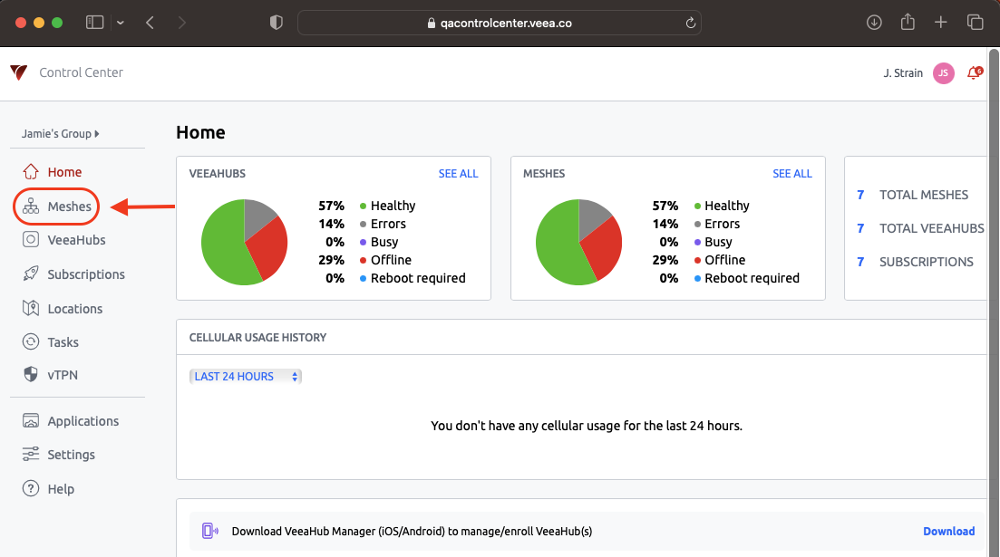
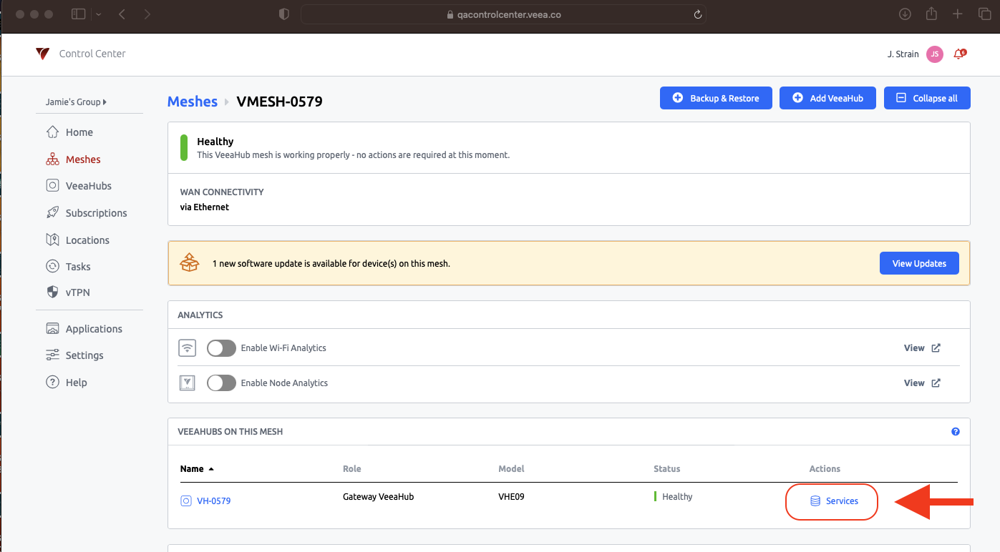
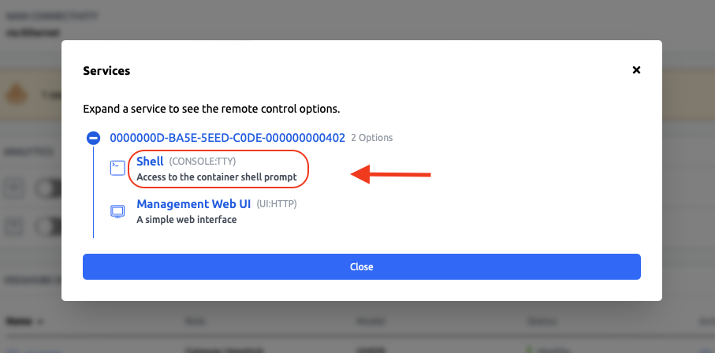
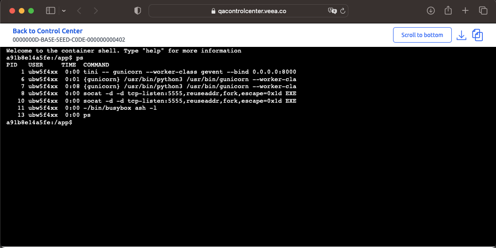

# An Example to Demonstrate Remote Container Access

This tutorial demonstrates remote container access using the template vh_cloud_mqtt_client.

!!! info
    In this tutorial you will learn:

    *   How to build and run the vh_cloud_mqtt_client template.

    *   How remote access to containers work by example
    

## Creating

The first step is to create an instance of the `vh_cloud_mqtt_client` template.

```console
$ vhc image create template vh_cloud_mqtt_client
Creating image directory vh_cloud_mqtt_client
Downloaded vh_cloud_mqtt_client.zip
Unzipped vh_cloud_mqtt_client.zip into vh_cloud_mqtt_client
```

You can enter the new directory and list the contents.

```console
$ cd vh_cloud_mqtt_client
$ ls
config.yaml  Dockerfile  README.md  src
```

## Configuring

No configuration of this template is necessary.

## Building

```console
$ vhc image build save --arch arm64v8
Saving arm64v8
Generating: /home/jstrain/veea/vht/vh_apps_newway/vh_app_cloud_mqtt_client/vh_cloud_mqtt_client/build/auth/Dockerfile
/home/jstrain/veea/vht/vh_apps_newway/vh_app_cloud_mqtt_client/vh_cloud_mqtt_client/build/auth/Dockerfile is newer than the cloud-mqtt-client-arm64v8:1.0.8 docker image.
Compiling image: cloud-mqtt-client arm64v8
Pruning previous instance of the same image
docker build  --build-arg ARCH=arm64v8 -t cloud-mqtt-client-arm64v8:1.0.8 -f /home/jstrain/veea/vht/vh_apps_newway/vh_app_cloud_mqtt_client/vh_cloud_mqtt_client/build/auth/Dockerfile /home/jstrain/veea/vht/vh_apps_newway/vh_app_cloud_mqtt_client/vh_cloud_mqtt_client
Sending build context to Docker daemon  205.1MB
Step 1/26 : ARG ARCH
Step 2/26 : FROM $ARCH/alpine:3.17
 ---> 51e60588ff2c
Step 3/26 : RUN apk update
 ---> [Warning] The requested image's platform (linux/arm64/v8) does not match the detected host platform (linux/amd64) and no specific platform was requested
 ---> Running in 0b30f73ede3b
fetch https://dl-cdn.alpinelinux.org/alpine/v3.17/main/aarch64/APKINDEX.tar.gz
fetch https://dl-cdn.alpinelinux.org/alpine/v3.17/community/aarch64/APKINDEX.tar.gz
v3.17.3-214-g48bebeebcd6 [https://dl-cdn.alpinelinux.org/alpine/v3.17/main]
v3.17.3-214-g48bebeebcd6 [https://dl-cdn.alpinelinux.org/alpine/v3.17/community]
OK: 17694 distinct packages available
Removing intermediate container 0b30f73ede3b
 ---> a98f90026494
Step 4/26 : RUN apk -U --allow-untrusted add     python3     py3-dbus-next     py3-flask     py3-gevent     py3-gunicorn     py3-paho-mqtt     socat     tini     ;
 ---> [Warning] The requested image's platform (linux/arm64/v8) does not match the detected host platform (linux/amd64) and no specific platform was requested
 ---> Running in 3f07e1ae6f2f
(1/36) Installing libbz2 (1.0.8-r4)
(2/36) Installing libexpat (2.5.0-r0)
(3/36) Installing libffi (3.4.4-r0)
(4/36) Installing gdbm (1.23-r0)
(5/36) Installing xz-libs (5.2.9-r0)
(6/36) Installing libgcc (12.2.1_git20220924-r4)
(7/36) Installing libstdc++ (12.2.1_git20220924-r4)
(8/36) Installing mpdecimal (2.5.1-r1)
(9/36) Installing ncurses-terminfo-base (6.3_p20221119-r0)
(10/36) Installing ncurses-libs (6.3_p20221119-r0)
(11/36) Installing readline (8.2.0-r0)
(12/36) Installing sqlite-libs (3.40.1-r0)
(13/36) Installing python3 (3.10.11-r0)
(14/36) Installing py3-dbus-next (0.2.3-r0)
(15/36) Installing py3-click (8.1.3-r0)
(16/36) Installing py3-itsdangerous (2.1.2-r0)
(17/36) Installing py3-markupsafe (2.1.1-r1)
(18/36) Installing py3-jinja2 (3.1.2-r0)
(19/36) Installing py3-werkzeug (2.2.2-r1)
(20/36) Installing py3-flask (2.2.2-r0)
(21/36) Installing py3-cparser (2.21-r0)
(22/36) Installing py3-cffi (1.15.1-r0)
(23/36) Installing py3-greenlet (2.0.1-r0)
(24/36) Installing py3-parsing (3.0.9-r0)
(25/36) Installing py3-packaging (21.3-r2)
(26/36) Installing py3-setuptools (65.6.0-r0)
(27/36) Installing py3-zope-event (4.5.0-r0)
(28/36) Installing py3-zope-interface (5.5.1-r0)
(29/36) Installing c-ares (1.19.1-r0)
(30/36) Installing libev (4.33-r0)
(31/36) Installing libuv (1.44.2-r0)
(32/36) Installing py3-gevent (22.10.2-r2)
(33/36) Installing py3-gunicorn (20.1.0-r0)
(34/36) Installing py3-paho-mqtt (1.6.1-r0)
(35/36) Installing socat (1.7.4.4-r0)
(36/36) Installing tini (0.19.0-r1)
Executing busybox-1.35.0-r29.trigger
OK: 88 MiB in 51 packages
Removing intermediate container 3f07e1ae6f2f
 ---> fa30aa69d73c
Step 5/26 : RUN mkdir /app
 ---> [Warning] The requested image's platform (linux/arm64/v8) does not match the detected host platform (linux/amd64) and no specific platform was requested
 ---> Running in a359c681fd4d
Removing intermediate container a359c681fd4d
 ---> 0d56f9a99f9b
Step 6/26 : COPY src/app/ /app/
 ---> 335d900ea8e9
Step 7/26 : WORKDIR /app
 ---> [Warning] The requested image's platform (linux/arm64/v8) does not match the detected host platform (linux/amd64) and no specific platform was requested
 ---> Running in e0132cbef134
Removing intermediate container e0132cbef134
 ---> 7ef1a0bdd8f4
Step 8/26 : COPY src/template/ /
 ---> 88b7da1e1303
Step 9/26 : RUN chmod -R a+wrX /run /var/log
 ---> [Warning] The requested image's platform (linux/arm64/v8) does not match the detected host platform (linux/amd64) and no specific platform was requested
 ---> Running in a7750fe6c1ea
Removing intermediate container a7750fe6c1ea
 ---> bb0552577a00
Step 10/26 : ARG ARCH
 ---> [Warning] The requested image's platform (linux/arm64/v8) does not match the detected host platform (linux/amd64) and no specific platform was requested
 ---> Running in 30e59a31a58f
Removing intermediate container 30e59a31a58f
 ---> aaab6770f26c
Step 11/26 : LABEL com.veea.vhc.architecture="$ARCH"
 ---> [Warning] The requested image's platform (linux/arm64/v8) does not match the detected host platform (linux/amd64) and no specific platform was requested
 ---> Running in 46a42743be85
Removing intermediate container 46a42743be85
 ---> 8d54b91506cd
Step 12/26 : LABEL com.veea.vhc.version="0.9.3-38-dirty"
 ---> [Warning] The requested image's platform (linux/arm64/v8) does not match the detected host platform (linux/amd64) and no specific platform was requested
 ---> Running in 6b35ff45a856
Removing intermediate container 6b35ff45a856
 ---> 165cdb45e936
Step 13/26 : LABEL com.veea.vhc.app.name="cloud-mqtt-client"
 ---> [Warning] The requested image's platform (linux/arm64/v8) does not match the detected host platform (linux/amd64) and no specific platform was requested
 ---> Running in 4110f712a901
Removing intermediate container 4110f712a901
 ---> 2a5514ee1107
Step 14/26 : LABEL com.veea.vhc.app.version="1.0.8"
 ---> [Warning] The requested image's platform (linux/arm64/v8) does not match the detected host platform (linux/amd64) and no specific platform was requested
 ---> Running in df3bdd5b3478
Removing intermediate container df3bdd5b3478
 ---> c28140edb889
Step 15/26 : LABEL com.veea.vhc.config.proj.version="3"
 ---> [Warning] The requested image's platform (linux/arm64/v8) does not match the detected host platform (linux/amd64) and no specific platform was requested
 ---> Running in edb81a038640
Removing intermediate container edb81a038640
 ---> 27d7c4e8a038
Step 16/26 : LABEL com.veea.vhc.config.user.version="3"
 ---> [Warning] The requested image's platform (linux/arm64/v8) does not match the detected host platform (linux/amd64) and no specific platform was requested
 ---> Running in 4cb97260a1df
Removing intermediate container 4cb97260a1df
 ---> 70b2e6f404d4
Step 17/26 : LABEL com.veea.authentication.identifier="PARTNER;0000000D;1632209644,1947569644;79E/jb0cEwOekGlfRD+M6YXgGLkuHaeeklX2nN5QeGo=;sha256;veeahub_license_server;MEYCIQDWL5lXKhNaYnIClus0rzTAr2s7CAWimspDjO/qq1hKBwIhAItYRwS7FaYt1UW3tI4PLSf4gGZ98yCLERPKzYukD1Gj"
 ---> [Warning] The requested image's platform (linux/arm64/v8) does not match the detected host platform (linux/amd64) and no specific platform was requested
 ---> Running in 15716553ee4d
Removing intermediate container 15716553ee4d
 ---> 8f2163f74498
Step 18/26 : LABEL com.veea.image.persistent_uuid="0000000D-BA5E-5EED-C0DE-000000000402"
 ---> [Warning] The requested image's platform (linux/arm64/v8) does not match the detected host platform (linux/amd64) and no specific platform was requested
 ---> Running in 3cbd9993bf8b
Removing intermediate container 3cbd9993bf8b
 ---> 52b1dffb6c43
Step 19/26 : LABEL com.veea.authorisation.allowOnUnauthenticatedHost="true"
 ---> [Warning] The requested image's platform (linux/arm64/v8) does not match the detected host platform (linux/amd64) and no specific platform was requested
 ---> Running in 8e8c3edda84b
Removing intermediate container 8e8c3edda84b
 ---> fb6a738d86dd
Step 20/26 : LABEL com.veea.authentication.certificates.partner="MIICHDCCAcKgAwIBAgIJAL3vKQdknJVtMAoGCCqGSM49BAMCMEcxETAPBgNVBAoMCFZlZWEgSW5jMTIwMAYDVQQDDClWZWVhIFBhcnRuZXIgMDAwMDAwMEQgU2lnbmluZyBDZXJ0aWZpY2F0ZTAeFw0yMTA5MjEwNzM0MDRaFw0zMTA5MTkwNzM0MDRaMEcxETAPBgNVBAoMCFZlZWEgSW5jMTIwMAYDVQQDDClWZWVhIFBhcnRuZXIgMDAwMDAwMEQgU2lnbmluZyBDZXJ0aWZpY2F0ZTBZMBMGByqGSM49AgEGCCqGSM49AwEHA0IABIjA9Lqlw+2BF7kfUa0bjs2ucITEH7DkbGECXL6m57iFmYb8WE8N4H/X5tahNb8ivq1oCQqoD81vZC9k6Ar8g3WjgZYwgZMwYQYDVR0jBFowWKFLpEkwRzERMA8GA1UECgwIVmVlYSBJbmMxMjAwBgNVBAMMKVZlZWEgUGFydG5lciAwMDAwMDAwRCBTaWduaW5nIENlcnRpZmljYXRlggkAve8pB2SclW0wHQYDVR0OBBYEFF6xVNAwqerRl3eiml1vTEF6wOKpMA8GA1UdEwEB/wQFMAMBAf8wCgYIKoZIzj0EAwIDSAAwRQIhAI9kBqOFcb+iZdhJ4MNQGZmVVuv/fZ55V5hGtv7pkmiqAiBnMiON8hHyEvO47ElB9m/wFLucCC7aHddzMw37R4Ex3w=="
 ---> [Warning] The requested image's platform (linux/arm64/v8) does not match the detected host platform (linux/amd64) and no specific platform was requested
 ---> Running in d2bb4779b148
Removing intermediate container d2bb4779b148
 ---> 513b17581a52
Step 21/26 : LABEL com.veea.authentication.certificates.veeahub_license_server="MIIB0jCCATSgAwIBAgIBATAKBggqhkjOPQQDAjBAMREwDwYDVQQKDAhWZWVhIEluYzEfMB0GA1UEAwwWVmVlYSBMaWNlbnNlIEF1dGhvcml0eTEKMAgGA1UELAwBMDAeFw0xODEyMDcxODE3NTlaFw0zMzEyMDMxODE3NTlaMEIxETAPBgNVBAoMCFZlZWEgSW5jMSEwHwYDVQQDDBhWZWVhIE1haW4gTGljZW5zZSBTZXJ2ZXIxCjAIBgNVBCwMATAwWTATBgcqhkjOPQIBBggqhkjOPQMBBwNCAAQqVnzlrPYomV3ZRVZaGxRv4xJPhKnkNa+PALfw8Xc/MemlcoLZmAKWWNRPjIyW2sOlYKr0+FpGIvZVZ4u/6iAFox0wGzAMBgNVHRMBAf8EAjAAMAsGA1UdDwQEAwICtDAKBggqhkjOPQQDAgOBiwAwgYcCQgCXFl2jBWtVp7H6ELCxLUs0tl4wFycLW4ANoKErrTcmv8TxlcsD0lUq6iBPQAmtlUW00QeVwNG2Ffavvli6Cvq+0AJBT8R4+UMqL6PKs2Dle3S6LwyEjmtAYwLv685LwPOTMzR4FiQoUmT1DVnR9rjudO18p5Uqzufwr3SABYv0FFtpVvM="
 ---> [Warning] The requested image's platform (linux/arm64/v8) does not match the detected host platform (linux/amd64) and no specific platform was requested
 ---> Running in 2f40520f256b
Removing intermediate container 2f40520f256b
 ---> eada2666da75
Step 22/26 : LABEL com.veea.authentication.certificates.veeahub_license_authority="MIICJDCCAYagAwIBAgIBBDAKBggqhkjOPQQDAjBLMQowCAYDVQQsDAEwMREwDwYDVQQKDAhWZWVhIEluYzEMMAoGA1UECwwDUEtJMRwwGgYDVQQDDBNWZWVhIFJvb3QgQXV0aG9yaXR5MB4XDTE4MTIwNzE4MTI1NVoXDTM4MTIwMjE4MTI1NVowQDERMA8GA1UECgwIVmVlYSBJbmMxHzAdBgNVBAMMFlZlZWEgTGljZW5zZSBBdXRob3JpdHkxCjAIBgNVBCwMATAwgZswEAYHKoZIzj0CAQYFK4EEACMDgYYABAE2fGY0fpdvS1moPN/3iTc5F9mTnEYtFeyj325dNpcT9OJPfYx/ORV0dMXY7OLXN87+0pR0a6gOnIAj5Ozlw0xBoQAyuPxDdmWKVAzg9g2+d01JqDQRyHUZdDzdtlGMh0JRvX2RHgtB+3jVvMVmzNdxmjJP0lsoJC26Io3K4WKjB+wNz6MjMCEwEgYDVR0TAQH/BAgwBgEB/wIBADALBgNVHQ8EBAMCAoQwCgYIKoZIzj0EAwIDgYsAMIGHAkEWk3a6EgOknqIQbDSoIGtczfq7LNmPegHyKg7WEodpT0PnRhB/pXctWOPA3k0i1BSuPCCa+5mKGhjTxDaUVbNNUwJCAYHfHkIaEkMeceloA7NmB85XBY6+ftnBEumzPth5C5QQ3RyoU4ktZ8A8PYjDbGGYD8l7V5Jl5yUd1w7Nl7Budqyf"
 ---> [Warning] The requested image's platform (linux/arm64/v8) does not match the detected host platform (linux/amd64) and no specific platform was requested
 ---> Running in f82ea28250fe
Removing intermediate container f82ea28250fe
 ---> 020f735a7b74
Step 23/26 : CMD ["gunicorn", "--worker-class", "gevent", "--bind", "0.0.0.0:8000", "--bind", "0.0.0.0:8001", "--workers", "1", "--timeout", "0", "--graceful-timeout", "5", "backend:app"]
 ---> [Warning] The requested image's platform (linux/arm64/v8) does not match the detected host platform (linux/amd64) and no specific platform was requested
 ---> Running in 7501417554f8
Removing intermediate container 7501417554f8
 ---> 7c707e3dfa04
Step 24/26 : ENTRYPOINT ["tini", "--"]
 ---> [Warning] The requested image's platform (linux/arm64/v8) does not match the detected host platform (linux/amd64) and no specific platform was requested
 ---> Running in 8ffc2df5e0ad
Removing intermediate container 8ffc2df5e0ad
 ---> 932425213a8c
Step 25/26 : LABEL maintainer "roger.lucas@veeasystems.com"
 ---> [Warning] The requested image's platform (linux/arm64/v8) does not match the detected host platform (linux/amd64) and no specific platform was requested
 ---> Running in 39e81ffd2b49
Removing intermediate container 39e81ffd2b49
 ---> dc883cf4b3c0
Step 26/26 : LABEL com.veea.authorisation.allowOnUnauthenticatedHost="true"
 ---> [Warning] The requested image's platform (linux/arm64/v8) does not match the detected host platform (linux/amd64) and no specific platform was requested
 ---> Running in 339f36cb2139
Removing intermediate container 339f36cb2139
 ---> e026bb9e0c47
Successfully built e026bb9e0c47
Successfully tagged cloud-mqtt-client-arm64v8:1.0.8
Saving: cloud-mqtt-client arm64v8
  Writing cloud-mqtt-client-arm64v8:1.0.8.unsigned.tar 
```

## Running

### Upload the Image

```console
$ vhc hub access upload-image ./vh_cloud_mqtt_client/build/auth/arm64v8/cloud-mqtt-client-arm64v8\:1.0.8.signed.tar
Creating image push for file [./vh_cloud_mqtt_client/build/auth/arm64v8/cloud-mqtt-client-arm64v8:1.0.8.signed.tar] on E09BCW00C0B000000579:9000 (images/push)...
####################################################################################################################################################################################################### 100.0%
{"image_id": "3c93c7461de3599366b0c7105f3f4dcbb4e0b3ae9a7f220de78ba659b4deaa2f"}
```

### Check the Uploaded Image

```console
$ vhc hub access shell

                  **      **   ********  **      **
                 /**     /**  **//////  /**     /**
                 /**     /** /**        /**     /**
                 //**    **  /********* /**********
                  //**  **   ////////** /**//////**
                   //****           /** /**     /**
                    //**      ********  /**     /**
                     //      ////////   //      //

    Welcome to the Veea shell.   Type help or ? to list commands.
            
[VHVHE0900000579-0000000D] docker image ls
REPOSITORY                  | TAG     | ID             | P-UUID                                 | NAME                | CREATED             | SIZE     
cloud-mqtt-client-arm64v8   | 1.0.8   | 3c93c7461de3   | 0000000D-BA5E-5EED-C0DE-000000000402   | cloud-mqtt-client   | About an hour ago   | 84.05MB  
[VHVHE0900000579-0000000D] 
```

### Create the Container

```text
[VHVHE0900000579-0000000D] docker image create cloud-mqtt-client:3c93c746 --detach 
a91b8e14a5fefd38577868aaca3ef680e556f6613a17a68e99fcf65c691cdc89
[VHVHE0900000579-0000000D]
```

### Start the Container

```text
[VHVHE0900000579-0000000D] docker container start cloud-mqtt-client:a91b8e14 
a91b8e14a5fefd38577868aaca3ef680e556f6613a17a68e99fcf65c691cdc89
[VHVHE0900000579-0000000D] 
```

### Verify the Container is running

```text
[VHVHE0900000579-0000000D] docker container ls
ID             | P-UUID                                 | NAME                | STATUS         | IMAGE          | CREATED        
a91b8e14a5fe   | 0000000D-BA5E-5EED-C0DE-000000000402   | cloud-mqtt-client   | Up 2 minutes   | 3c93c7461de3   | 2 minutes ago  
[VHVHE0900000579-0000000D]  
```

## Remote Container Access

Follow the following steps to get remote access to the container:

1.  Login to Veea Control Center
    

https://controlcenter.veea.co/

2\. Select ‘Meshes’ like in the following example:


3\. Select the mesh which has the VeeaHub running the vh_cloud_mqtt_client template we are demonstrating here.


4\. Select ‘Services’ under Column ‘ACTIONS’ like in the following example:


5\. Select ‘Shell’ like in the following example:


6\. The following window should now appear with access to the shell like the following example:



## How Remote Access to Containers Work by example

Veea is introducing a Cloud Proxy service for partner containers. This service can be requested by the containers at any time, and will trigger the creation of a proxy service within the Veea Cloud, that allows incoming connections to be routed to the VeeaHub’s container.

The Cloud Proxy comes in two parts. Firstly, a VeeaHub or container may expose a service directly on the Internet, which anyone can connect to. Secondly, a VeeaHub or container may expose a service to a specific set of users, groups or roles via Veea’s Control Center.

In its initial release, the service allows the following traffic types to be routed from the Internet or Control Center to the VeeaHub:

*   HTTP • HTTPS • TLS
    

### Container APIs

The container requests the service using DBus. This must be done each time the container starts. Any proxy services will be removed automatically when the container stops.

The VeeaHub provides simple APIs to request a service, check the status of a service, list services, and remove a service.

*   RegisterReverseProxy()
    
    *   This registers a reverse proxy service. The service may include TLS offload with optional Let’s Encrypt certificates.
        
*   GetStatus()
    
    *   This returns the status for a reverse proxy service.
        
*   ListProxies()
    
    *   This command takes no arguments and returns a list of all active proxies that belong to the con‐ tainer.
        
*   Unregister()
    
    *   This removes a reverse proxy service.
        
*   ConfigureVeeaCloudAccess()
    
    *   This command allows the container to control access to a service published using api RegisterReverseProxy()
        

### Security

The container must take steps to ensure that its exposed ports are secure, as this service can allow access to the container from the public Internet. The container developer should following industry best practice in their design.

### Basic flow:

*   container makes request to the VeeaHub for the 'ReverseProxy' service (EVERY TIME the container starts). And Proxy service is removed when container stops
    
*   VeaHub passes this to the Veea Cloud which configures the DNS entries and service presence
    
*   Veeahub then establishes tunnel to the Veea Cloud which will carry the service traffic
    
*   The client connects to the appropriate FQDN, which is routed in the Veea Cloud.
    
*   The Veea Cloud then identifies the correct VeeaHub for the traffic based on the HTTP server name or TLS SNI, and forwards the traffic up the tunnel to the VeeaHub, where its then forwards to the container
    

### Example proxy to a local container console port which is only accessible from Control Center

*   Steps taken by container when it starts:
    
    *   dbus - get mqtt config from VeeaHub host then use this mqtt configuation to start mqtt client connecting to VeeaHub MQTT Broker
        
    *   Start a socat listener on port 5555 which will provide a shell to hosted container.
        
        *   Need to register a proxy that is ‘veea cloud’ only (which means is not accessible from Internet) and provides access to a configured port which is port 5555 in this example. Registration example continues below.
            
        *   Need to configure Veea Cloud access to this port which will help Control Center know how it should connect to this port. This also ensures Control Center has the proper permissions to connect. Configuring Veea Cloud access continues below.
            
    *   Registering Veea Cloud console service proxy
        
        *   dbus RegisterReverseProxy("veea_cloud", "", 0, "tcp", "", "", 5555, "")
            
            *   Sets up the proxy routing where it registers the reverse proxy service to port 5555 where a ‘socat’ listener is waiting for a connection from the Control Center client.
                
            *   Setting ‘Network’ parameter to ‘veea_cloud’ means there will be no accessibility from the Internet. Accessability will only be from Control Center
                
    *   Configure Veea Cloud Access
        
        *   dbus ConfigureVeeaCloudAccess(token,"console:tty", "Shell", "Access to the container shell prompt",  
            \[ {  
            "Allow": dbus_next.Variant("b", True),  
            "Group": dbus_next.Variant("s", "admin")  
            } \])
            
            *   This allows the container to control access based on the token returned from ‘RegisterReverseProxy()’ published service. ConfigureVeeaCloudAccess() provides additional information to Control Center regarding the high level protocol (console:tty) being used by the service and which users and groups in Control Center should be allowed access.
                

This is a high-level view, for more details refer to the following two documents:

*   [Remote Access to Containers](../../applications/remote-access-to-containers.md)

*   [Dynamic Container Configuration and State](../../applications/dynamic-container-configuration-and-state.md)
