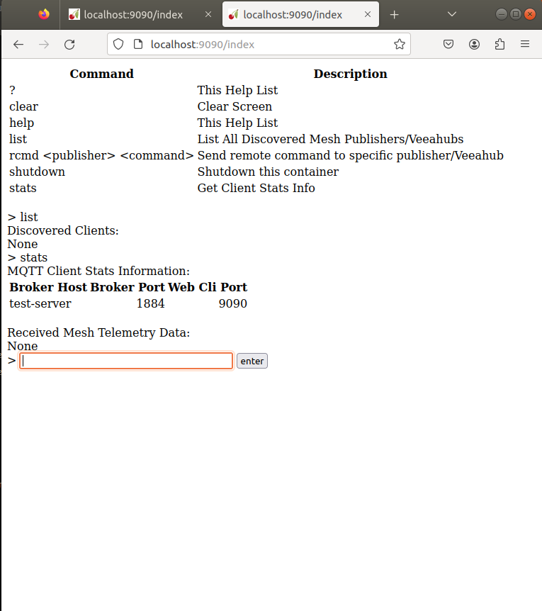

# Mesh-enabled Template Example Configuration

## Working with the Cloud Side

In this cloud-specific section, we will set up all the configuration that is needed such as what server name to use for the cloud broker, generate the TLS keys and certs and generate the user-config.json to be used by the mesh section later on. Then start the cloud broker and client containers. Lastly, we will use our Cloud web client to verify only that the mqtt cloud broker and client containers can communicate with each other.

### Configure Cloud and Mesh Brokers

The only configuration parameter you need to know to get this to work is the hostname of the Linux Server you want to run the Cloud MQTT Broker and client on. Ideally, this could be the same machine that VHT is installed on. This demonstration is currently running Ubuntu 18.04 and has VHT 1.2.1-1 installed.

Determining the server name is the only required configuration change needed but we need to make sure that our local DNS knows of it by resolving it to an IP address. This is important because this is exactly what your VeeaHub MEN will try to do later when we configure the mesh bridge broker to communicate with this server name which will be running the cloud broker. So as a quick test, add a unique hostname to your /etc/hostname. Then reboot your Linux box. After it comes up ping the server name you added from a different machine than your server to see if DNS knows about it. My example ping test below looks good.

```bash
jstrain@test-server:~/shared/veea-hub-mount/test_vht/VHT-357-template-example-showing-distrib/c3-templates/vh_distributed_mqtt$ cat /etc/hostname
test-server
jstrain@test-server:~/shared/veea-hub-mount/test_vht/
VHT-357-template-example-showing-distrib/c3-templates/vh_distributed_mqtt$ ping test-server
PING test-server.myfiosgateway.com (192.168.1.196) 56(84) bytes of data.
64 bytes from ubuntu (192.168.1.196): icmp_seq=1 ttl=64 time=0.029 ms
^C
--- test-server.myfiosgateway.com ping statistics ---
1 packets transmitted, 1 received, 0% packet loss, time 0ms
rtt min/avg/max/mdev = 0.029/0.029/0.029/0.000 ms
jstrain@test-server:~/shared/veea-hub-mount/test_vht/VHT-357-template-example-showing-distrib/c3-templates/vh_distributed_mqtt$ 
```

The only configuration change you will have to make in this whole demonstration is to change the hostname from 'test-server' in the following 3 files to whatever the hostname of your server will be.

*   cloudx/init-config.sh
    
*   cloudx/docker-compose-cloud-instance.yaml
    

The last step of the configuration stage is to generate the Cloud Broker's TLS Keys and certs and then generate the cloudx/user-config.json.gen file using the command below. More information about usage of user-config.json file can be seen here Issue the following commands to generate the needed configuration

```bash
$ cd cloudx
$ ./init-config.sh
```

Example output below:

```bash
jstrain@test-server:~/shared/veea-hub-mount/test_vht/VHT-357-template-example-showing-distrib/c3-templates/vh_distributed_mqtt/cloudx$ ./init-config.sh 
+ gen_certs test-server
+ CLOUD_BROKER_SERVER_NAME=test-server
+ rm -rf certs
+ mkdir certs
+ rm -rf broker
+ mkdir -p broker/mosquitto/certs
+ rm -rf tmp
+ mkdir tmp
+ cd tmp
+ gen_san_cnf test-server DNS.1=test-server
+ COMMON_NAME=test-server
+ ALT_NAMES=DNS.1=test-server
+ cat
+ openssl genrsa -out root.key 4096
Generating RSA private key, 4096 bit long modulus (2 primes)
..................................................................................................++++
.................++++
e is 65537 (0x010001)
+ openssl req -new -sha256 -key root.key -nodes -out root.csr -subj /C=US/ST=NJ/L=Edison/O=Veea/CN=VHT Testing CA
+ openssl x509 -req -sha256 -days 365 -in root.csr -signkey root.key -out root.crt
Signature ok
subject=C = US, ST = NJ, L = Edison, O = Veea, CN = VHT Testing CA
Getting Private key
+ openssl genrsa -out server.key 4096
Generating RSA private key, 4096 bit long modulus (2 primes)
..........................................................++++
.........++++
e is 65537 (0x010001)
+ openssl req -new -sha256 -key server.key -out server.csr -config san.cnf -subj /C=US/ST=NJ/L=Edison/O=Veea/CN=Testing Cloud Side MQTT Broker
+ openssl x509 -req -in server.csr -CA root.crt -CAkey root.key -CAcreateserial -out server.crt -days 365 -sha256 -extensions req_ext -extfile san.cnf
Signature ok
subject=C = US, ST = NJ, L = Edison, O = Veea, CN = Testing Cloud Side MQTT Broker
Getting CA Private Key
+ cp root.crt ../certs/ca.crt
+ cat root.crt
+ base64 -w 0
+ cp root.crt.b64 ../certs/ca.crt.b64
+ cp server.key ../certs
+ cp server.crt ../certs
+ cp ../certs/ca.crt ../certs/ca.crt.b64 ../certs/server.crt ../certs/server.key ../broker/mosquitto/certs
+ cd -
/home/jstrain/shared/veea-hub-mount/test_vht/VHT-357-template-example-showing-distrib/c3-templates/vh_distributed_mqtt/cloudx
+ echo veea:aeev
+ pwd
+ docker run -it -v /home/jstrain/shared/veea-hub-mount/test_vht/VHT-357-template-example-showing-distrib/c3-templates/vh_distributed_mqtt/cloudx:/pwd eclipse-mosquitto sh -c set -x ;mosquitto_passwd -U pwd/broker/mosquitto/passwd
+ mosquitto_passwd -U pwd/broker/mosquitto/passwd
Warning: File /pwd/broker/mosquitto/passwd has world readable permissions. Future versions will refuse to load this file.
To fix this, use `chmod 0700 /pwd/broker/mosquitto/passwd`.+ cat certs/ca.crt.b64
+ mqtt_cloud_broker_ca_cert_b64=LS0tLS1CRUdJTiBDRVJUSUZJQ0FURS0tLS0tCk1JSUZMVENDQXhVQ0ZHR3hNQWZsYWIrY1gvWUlodDVzQWhlSkptL0FNQTBHQ1NxR1NJYjNEUUVCQ3dVQU1GTXgKQ3pBSkJnTlZCQVlUQWxWVE1Rc3dDUVlEVlFRSURBSk9TakVQTUEwR0ExVUVCd3dHUldScGMyOXVNUTB3Q3dZRApWUVFLREFSV1pXVmhNUmN3RlFZRFZRUUREQTVXU0ZRZ1ZHVnpkR2x1WnlCRFFUQWVGdzB5TkRBME1qUXhOelV4Ck5ERmFGdzB5TlRBME1qUXhOelV4TkRGYU1GTXhDekFKQmdOVkJBWVRBbFZUTVFzd0NRWURWUVFJREFKT1NqRVAKTUEwR0ExVUVCd3dHUldScGMyOXVNUTB3Q3dZRFZRUUtEQVJXWldWaE1SY3dGUVlEVlFRRERBNVdTRlFnVkdWegpkR2x1WnlCRFFUQ0NBaUl3RFFZSktvWklodmNOQVFFQkJRQURnZ0lQQURDQ0Fnb0NnZ0lCQU5UenNMM0xJMTNZCkRraDZIYi9sRHcrM3lhR2tSb2tkNXhRblN2bFB1L2FBVjgyZ3Y3TXNJLzEzQ01lNTlIOFNwT0kwamd2dHhBSVUKNXVzL0ZUL3FtSFFBYXlQbFdjY3dQbEt2N3Rndm1IY2VkbmlJbm1XeFRzZmg0Ymo3L3JDdTQ1NGZGSjl3dUt2UQpwTXFWTURpcXh3WTZNSExINC9LYTYwR2JITm14UC9vSzhqZlVESCtMQjE0ZnhrWDVLZzVIVzZMNFhhRDN1TjZvClhXa0ExVnRxOVhjNkNnYWJFd2p2UFVjak9JdGExTytMN1pSR3FPWHpNamZJcVkxa0ZYNlludTVjRC8yL0QydHcKZUFUYXJnRm5SRCtJV1VGK2NRNXNwK0g1TlJ4NkZPUGFENTNpOW0wVVhVSS9yTEJWZjE4cWNwc081c3A1U3VWdgorSkk3ejVxZ3Fad1NJNUsrUWJtTDBSK2RIeDU1MnZ5dE9tTFBGRkxGWmtDK01rVURuMFl0UG9wMWRyNFpXQU1VCktzS01jclNhUXM5Y3ZkejlhVWErYTFtMlFDREJWK2xLanJKSFBucHZ5OFRFNlJMVmI2UVJoTXhzY240N0ZSYUgKTzJJVjNMT0dwQnV6d2VFa2NySXloYWhkK1E0bDlBMDFBdVBITnZvZzhuY3FXNC95bndEQ3UwY3hrUXdJT3FTUQphaTJrU2tqWFd2M2FuZk0yckZSNEd0amxnK2pPeituRTNudFJkaVhZWVJVcDlyV0NKamtzTzFyYVhoVEZqNWphCkJOTUhsa1pTRS82WWlYLzNJUWFaM3ZWdTR1THo3OXU0S0pOLzhKL1NacGNzb3FydEM4U3FXQXRDMUlLMkh1ZHIKOVZibkFiZTNyR285NXJqb3BXMERVK0dUWGMvdDhUSUxBZ01CQUFFd0RRWUpLb1pJaHZjTkFRRUxCUUFEZ2dJQgpBS1pxTkZnay9tUUVYdjh6bW11a2VYQU9ISGh0Y2NqRWlES09DTFVEZHU0VXZlaXZ2aHBtRXJSSGtyZjVnS1dBCjVDMTNWQWJaZkJYZHFRYTMxNzF3c2Y5TzJIWG14M3VrYTJqRFh6dGlRZTdPMDBaMG10YlBHNkg0Qmt3eXpPVysKTzJrL1hIWTQxTDgrcmN2eEZSck1zK3UwdTdiTFIzcEU0VmhuTkV6cVpHUU03ditTOVBxaG8vQnl3NUZjU1RSSwp3b0VNTW43L29SbzA5NzNUUXFGM2JKclFkUHV2NkJTUW5zMCtYU201VzM2aUJ0VFdQSjNiazZ5QjdObXEvdzV1ClM0dHhQVlBKbG1KVXhZZ3pvSFR5UXNIcmRZU0VKKzhoSEZRV3ptL3RlblBrdzVzbXpyUlk1cVllUmxrQTMzNkQKcjJRaU1OOEE2VzNvZlR1cmwxTy9aNzl6MytQWFlnK3NwYXVWblVWcnlvOTVyaW56d052aFBwK0pBMERXWUp1bwovME5wYndIQURrdE9mTTg5cURMVHhrd0xUdW5YOUNSWjlCUlRJRHVOaDVMMU81NGFleDhNcm8wUW8vYVJMaEZHCnNMTldIN1NhSy9ia0NnZCtYTkpNZkxDUnNCdU5GcjBDZGZIc1dualhQSVpIanN0Rm56aHZYNlpMbU94amJyaUIKUnpGbTMwTzVxNkZTUWFHM0dLWndKcCtvdlg1M0dDVDdzdWE2SFhYbm8zR3BJZHdhY0dkVG4vMGtnczB1dks1dgpXNDBkNmdwSWNnVDVxRHJVK3BvV3h1WDROaUJmaGxYVjIxRXl6NWtYTjFGbi8xeFlsUGZ1T2hnT3lBcGJZL1duCmwrNTdJMlg1N1Nnc1JsaXVMU3hSM3MxeGUvVEw1K3BpcFJrdUVYaTdyVVJtCi0tLS0tRU5EIENFUlRJRklDQVRFLS0tLS0K
+ jq -n --arg mqtt_cloud_broker_hostname test-server --arg mqtt_cloud_broker_port 8883 --arg mqtt_cloud_broker_username veea --arg mqtt_cloud_broker_password aeev --arg mqtt_cloud_broker_ca_cert_b64 LS0tLS1CRUdJTiBDRVJUSUZJQ0FURS0tLS0tCk1JSUZMVENDQXhVQ0ZHR3hNQWZsYWIrY1gvWUlodDVzQWhlSkptL0FNQTBHQ1NxR1NJYjNEUUVCQ3dVQU1GTXgKQ3pBSkJnTlZCQVlUQWxWVE1Rc3dDUVlEVlFRSURBSk9TakVQTUEwR0ExVUVCd3dHUldScGMyOXVNUTB3Q3dZRApWUVFLREFSV1pXVmhNUmN3RlFZRFZRUUREQTVXU0ZRZ1ZHVnpkR2x1WnlCRFFUQWVGdzB5TkRBME1qUXhOelV4Ck5ERmFGdzB5TlRBME1qUXhOelV4TkRGYU1GTXhDekFKQmdOVkJBWVRBbFZUTVFzd0NRWURWUVFJREFKT1NqRVAKTUEwR0ExVUVCd3dHUldScGMyOXVNUTB3Q3dZRFZRUUtEQVJXWldWaE1SY3dGUVlEVlFRRERBNVdTRlFnVkdWegpkR2x1WnlCRFFUQ0NBaUl3RFFZSktvWklodmNOQVFFQkJRQURnZ0lQQURDQ0Fnb0NnZ0lCQU5UenNMM0xJMTNZCkRraDZIYi9sRHcrM3lhR2tSb2tkNXhRblN2bFB1L2FBVjgyZ3Y3TXNJLzEzQ01lNTlIOFNwT0kwamd2dHhBSVUKNXVzL0ZUL3FtSFFBYXlQbFdjY3dQbEt2N3Rndm1IY2VkbmlJbm1XeFRzZmg0Ymo3L3JDdTQ1NGZGSjl3dUt2UQpwTXFWTURpcXh3WTZNSExINC9LYTYwR2JITm14UC9vSzhqZlVESCtMQjE0ZnhrWDVLZzVIVzZMNFhhRDN1TjZvClhXa0ExVnRxOVhjNkNnYWJFd2p2UFVjak9JdGExTytMN1pSR3FPWHpNamZJcVkxa0ZYNlludTVjRC8yL0QydHcKZUFUYXJnRm5SRCtJV1VGK2NRNXNwK0g1TlJ4NkZPUGFENTNpOW0wVVhVSS9yTEJWZjE4cWNwc081c3A1U3VWdgorSkk3ejVxZ3Fad1NJNUsrUWJtTDBSK2RIeDU1MnZ5dE9tTFBGRkxGWmtDK01rVURuMFl0UG9wMWRyNFpXQU1VCktzS01jclNhUXM5Y3ZkejlhVWErYTFtMlFDREJWK2xLanJKSFBucHZ5OFRFNlJMVmI2UVJoTXhzY240N0ZSYUgKTzJJVjNMT0dwQnV6d2VFa2NySXloYWhkK1E0bDlBMDFBdVBITnZvZzhuY3FXNC95bndEQ3UwY3hrUXdJT3FTUQphaTJrU2tqWFd2M2FuZk0yckZSNEd0amxnK2pPeituRTNudFJkaVhZWVJVcDlyV0NKamtzTzFyYVhoVEZqNWphCkJOTUhsa1pTRS82WWlYLzNJUWFaM3ZWdTR1THo3OXU0S0pOLzhKL1NacGNzb3FydEM4U3FXQXRDMUlLMkh1ZHIKOVZibkFiZTNyR285NXJqb3BXMERVK0dUWGMvdDhUSUxBZ01CQUFFd0RRWUpLb1pJaHZjTkFRRUxCUUFEZ2dJQgpBS1pxTkZnay9tUUVYdjh6bW11a2VYQU9ISGh0Y2NqRWlES09DTFVEZHU0VXZlaXZ2aHBtRXJSSGtyZjVnS1dBCjVDMTNWQWJaZkJYZHFRYTMxNzF3c2Y5TzJIWG14M3VrYTJqRFh6dGlRZTdPMDBaMG10YlBHNkg0Qmt3eXpPVysKTzJrL1hIWTQxTDgrcmN2eEZSck1zK3UwdTdiTFIzcEU0VmhuTkV6cVpHUU03ditTOVBxaG8vQnl3NUZjU1RSSwp3b0VNTW43L29SbzA5NzNUUXFGM2JKclFkUHV2NkJTUW5zMCtYU201VzM2aUJ0VFdQSjNiazZ5QjdObXEvdzV1ClM0dHhQVlBKbG1KVXhZZ3pvSFR5UXNIcmRZU0VKKzhoSEZRV3ptL3RlblBrdzVzbXpyUlk1cVllUmxrQTMzNkQKcjJRaU1OOEE2VzNvZlR1cmwxTy9aNzl6MytQWFlnK3NwYXVWblVWcnlvOTVyaW56d052aFBwK0pBMERXWUp1bwovME5wYndIQURrdE9mTTg5cURMVHhrd0xUdW5YOUNSWjlCUlRJRHVOaDVMMU81NGFleDhNcm8wUW8vYVJMaEZHCnNMTldIN1NhSy9ia0NnZCtYTkpNZkxDUnNCdU5GcjBDZGZIc1dualhQSVpIanN0Rm56aHZYNlpMbU94amJyaUIKUnpGbTMwTzVxNkZTUWFHM0dLWndKcCtvdlg1M0dDVDdzdWE2SFhYbm8zR3BJZHdhY0dkVG4vMGtnczB1dks1dgpXNDBkNmdwSWNnVDVxRHJVK3BvV3h1WDROaUJmaGxYVjIxRXl6NWtYTjFGbi8xeFlsUGZ1T2hnT3lBcGJZL1duCmwrNTdJMlg1N1Nnc1JsaXVMU3hSM3MxeGUvVEw1K3BpcFJrdUVYaTdyVVJtCi0tLS0tRU5EIENFUlRJRklDQVRFLS0tLS0K --arg mqtt_mesh_broker_port 1883 {mqtt_cloud_broker_hostname: $mqtt_cloud_broker_hostname, mqtt_cloud_broker_port: $mqtt_cloud_broker_port,mqtt_cloud_broker_username: $mqtt_cloud_broker_username, mqtt_cloud_broker_password: $mqtt_cloud_broker_password,mqtt_cloud_broker_ca_cert_b64: $mqtt_cloud_broker_ca_cert_b64, mqtt_mesh_broker_port: $mqtt_mesh_broker_port, }
+ cp config/mosquitto.conf.cloud broker/mosquitto/
jstrain@test-server:~/shared/veea-hub-mount/test_vht/VHT-357-template-example-showing-distrib/c3-templates/vh_distributed_mqtt/cloudx$ 
```

### Start Cloud Side Broker and Client

Now that all the configurations have been created and are in place only for the cloud side, we will start both the cloud broker and client containers. Expect no errors and expect output similar to below.

```bash
$ ./up-cloud.sh
```

Example output below where you should see log messages from both the cloud broker 'cloud-broker' and from the cloud client 'mqtt-cloud-clients':

```bash
jstrain@test-server:~/shared/veea-hub-mount/test_vht/VHT-357-template-example-showing-distrib/c3-templates/vh_distributed_mqtt/cloudx$ ./up-cloud.sh 
/usr/bin/docker-compose
+ COMPOSE_FILE_BASE=docker-compose-base.yaml
+ COMPOSE_FILE_INSTANCE1=docker-compose-cloud-instance.yaml
+ docker-compose -p cloud -f docker-compose-base.yaml -f docker-compose-cloud-instance.yaml down
Removing network cloud_default
WARNING: Network cloud_default not found.
+ docker-compose -p cloud -f docker-compose-base.yaml -f docker-compose-cloud-instance.yaml up --build
WARNING: The Docker Engine you're using is running in swarm mode.

Compose does not use swarm mode to deploy services to multiple nodes in a swarm. All containers will be scheduled on the current node.

To deploy your application across the swarm, use `docker stack deploy`.

Creating network "cloud_default" with the default driver
Building cloud-clients
Step 1/6 : FROM alpine:3.19 as builder
 ---> 05455a08881e
Step 2/6 : WORKDIR /app
 ---> Using cache
 ---> 9653ea83f7ad
Step 3/6 : RUN set -x &&     apk --no-cache add python3 tini openssl     cmd:pip3 &&     python3 -m venv /app/venv &&     . /app/venv/bin/activate &&     pip3 install pydbus paho-mqtt dnspython cherrypy tabulate
 ---> Using cache
 ---> 82406e808082
Step 4/6 : COPY src/ /app/
 ---> Using cache
 ---> baf2ece17735
Step 5/6 : CMD ["/app/start-debug-loop.sh"]
 ---> Using cache
 ---> 1784f54fbb86
Step 6/6 : ENTRYPOINT ["tini", "--"]
 ---> Using cache
 ---> 63d16d30f9e3

Successfully built 63d16d30f9e3
Successfully tagged mqtt_client:1.0
Creating cloud-broker ... 
Creating cloud-broker ... done
Creating mqtt_cloud_clients ... 
Creating mqtt_cloud_clients ... done
Attaching to cloud-broker, mqtt_cloud_clients
cloud-broker    | 1713895816: mosquitto version 2.0.18 starting
cloud-broker    | 1713895816: Config loaded from /etc/mosquitto/mosquitto.conf.cloud.
cloud-broker    | 1713895816: Warning: File /etc/mosquitto/passwd has world readable permissions. Future versions will refuse to load this file.
cloud-broker    | To fix this, use `chmod 0700 /etc/mosquitto/passwd`.
cloud-broker    | 1713895816: Opening ipv4 listen socket on port 1884.
cloud-broker    | 1713895816: Opening ipv6 listen socket on port 1884.
cloud-broker    | 1713895816: Opening ipv4 listen socket on port 8883.
cloud-broker    | 1713895816: Opening ipv6 listen socket on port 8883.
cloud-broker    | 1713895816: mosquitto version 2.0.18 running
mqtt_cloud_clients | + source /app/venv/bin/activate
mqtt_cloud_clients | + deactivate nondestructive
mqtt_cloud_clients | + '[' -n  ]
mqtt_cloud_clients | + '[' -n  ]
mqtt_cloud_clients | + hash -r
mqtt_cloud_clients | + '[' -n  ]
mqtt_cloud_clients | + unset VIRTUAL_ENV
mqtt_cloud_clients | + unset VIRTUAL_ENV_PROMPT
mqtt_cloud_clients | + '[' '!' nondestructive '=' nondestructive ]
mqtt_cloud_clients | + VIRTUAL_ENV=/app/venv
mqtt_cloud_clients | + export VIRTUAL_ENV
mqtt_cloud_clients | + _OLD_VIRTUAL_PATH=/usr/local/sbin:/usr/local/bin:/usr/sbin:/usr/bin:/sbin:/bin
mqtt_cloud_clients | + PATH=/app/venv/bin:/usr/local/sbin:/usr/local/bin:/usr/sbin:/usr/bin:/sbin:/bin
mqtt_cloud_clients | + export PATH
mqtt_cloud_clients | + '[' -n  ]
mqtt_cloud_clients | + '[' -z  ]
mqtt_cloud_clients | + _OLD_VIRTUAL_PS1='\w \$ '
mqtt_cloud_clients | + PS1='(venv) \w \$ '
mqtt_cloud_clients | + export PS1
mqtt_cloud_clients | + VIRTUAL_ENV_PROMPT='(venv) '
mqtt_cloud_clients | + export VIRTUAL_ENV_PROMPT
mqtt_cloud_clients | + hash -r
mqtt_cloud_clients | + python3 /app/cloud-client.py --broker_host test-server --broker_port 1884 --cli_web_port 9090 --broker_username veea --broker_password aeev
mqtt_cloud_clients | 2024-04-23 18:10:19,157: cloud_mqtt_client: start: Broker Host:test-server Broker Port:1884 Web Cli Port: 9090
cloud-broker    | 1713895819: New connection from 172.24.0.1:37464 on port 1884.
mqtt_cloud_clients | 2024-04-23 18:10:19,166: cloud_mqtt_client: publish_discover_msg_req: publish_discover_msg_req() start
cloud-broker    | 1713895819: New client connected from 172.24.0.1:37464 as cloud-client-36 (p2, c1, k60, u'veea').
cloud-broker    | 1713895819: No will message specified.
cloud-broker    | 1713895819: Sending CONNACK to cloud-client-36 (0, 0)
mqtt_cloud_clients | [23/Apr/2024:18:10:19] ENGINE Bus STARTING
mqtt_cloud_clients | 2024-04-23 18:10:19,168: cloud_mqtt_client: wait_for_shutdown: blocking until shutdown called
mqtt_cloud_clients | CherryPy Checker:
mqtt_cloud_clients | The Application mounted at '' has an empty config.
mqtt_cloud_clients | 
mqtt_cloud_clients | [23/Apr/2024:18:10:19] ENGINE Started monitor thread 'Autoreloader'.
mqtt_cloud_clients | 2024-04-23 18:10:19,169: cloud_mqtt_client: on_connect: Subscribed to topic: rsp
mqtt_cloud_clients | 2024-04-23 18:10:19,170: cloud_mqtt_client: on_connect: Subscribed to topic: data
mqtt_cloud_clients | 2024-04-23 18:10:19,170: cloud_mqtt_client: on_connect: Connected to MQTT Broker!
cloud-broker    | 1713895819: Received SUBSCRIBE from cloud-client-36
cloud-broker    | 1713895819: 	rsp/# (QoS 0)
cloud-broker    | 1713895819: cloud-client-36 0 rsp/#
cloud-broker    | 1713895819: Sending SUBACK to cloud-client-36
cloud-broker    | 1713895819: Received SUBSCRIBE from cloud-client-36
cloud-broker    | 1713895819: 	data/# (QoS 0)
cloud-broker    | 1713895819: cloud-client-36 0 data/#
cloud-broker    | 1713895819: Sending SUBACK to cloud-client-36
mqtt_cloud_clients | 2024-04-23 18:10:19,172: cloud_mqtt_client: on_subscribe: Subscribed
mqtt_cloud_clients | 2024-04-23 18:10:19,173: cloud_mqtt_client: on_subscribe: Subscribed
mqtt_cloud_clients | [23/Apr/2024:18:10:19] ENGINE Serving on http://0.0.0.0:9090
mqtt_cloud_clients | [23/Apr/2024:18:10:19] ENGINE Bus STARTED
```

## Open Cloud Side Client Web Interface

The last thing we will do on the cloud side for the moment is to test that our cloud client test web app is working.

Open a local web browser and enter URL: localhost:9090:/

Notice in the screenshot below that the output of the 'list' command shows no mesh clients yet. Also, the output of the 'stats' command shows not mesh telemetry data yet either. This is all because the Mesh MQTT broker and client services are not running as of now, but will soon be.


