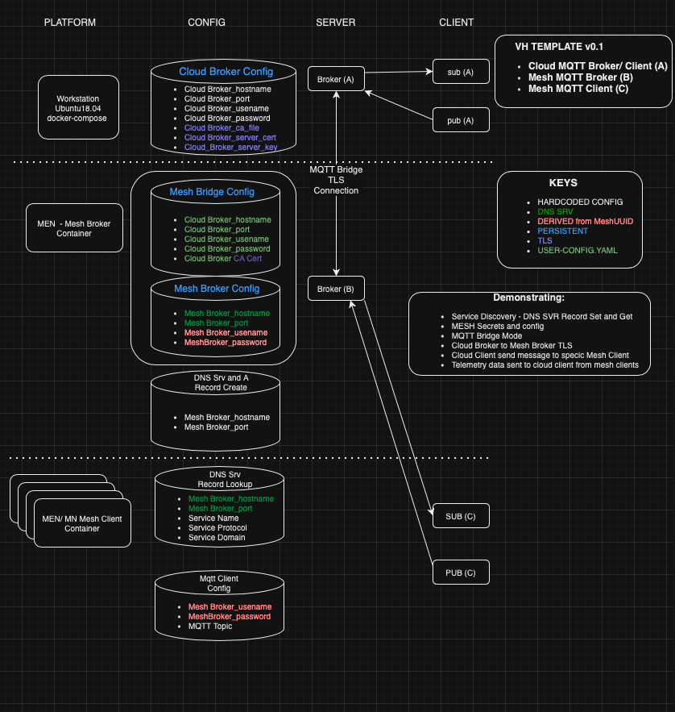
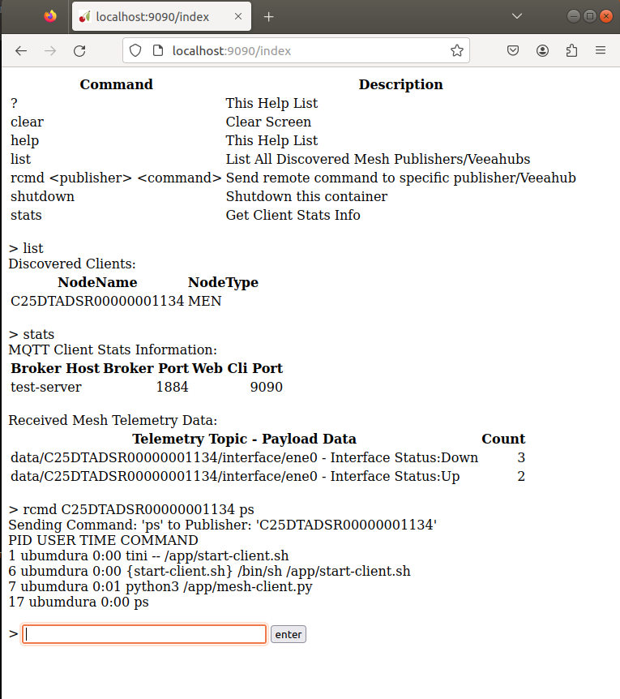

# Mesh-enabled Template Example Instantiation

!!! info
    This is available in 1.2.2 and later.

## VeeaHub Distributed MQTT Application Summary

This distributed MQTT template application demonstrates the following:

*   Service Discovery using DNS Service (SRV) Record Set and Get. Applications running in the mesh that provide a new service can make their service's hostname and port number discoverable via DNS's SRV Record query. The application providing the service needs to call two Dbus methods (RegisterDnsHost & RegisterDnsSRV) to set up the SRV record. Then any client wanting to discover the service to retrieve the service's hostname and port can query DNS for the SRV record matching a specific Service FQDN to get that information.
    
*   MESH Secrets
    
    *   The mesh's MQTT authorization username/password between the mesh broker and mesh client can be derived using the unique meshUUID key as a way to safely manage these secrets instead of being hardcoded in the docker image.
        
    *   Configuration data such as port numbers, certificates and secrets can be provided in a JSON file (/usr/local/config/default/user-config.json) made accessible to the container that is volume mounted alongside the container and is not part of the image in any way for security concerns. Control Center Application's JSON schema provides this mechanism for Control Center uploaded apps. The same configuration is available for VHT users using WebDAV to be able to leverage common code for user-config.json processing. The mesh's broker config will rely on this configuration capability.
        
*   MQTT Bridge Mode- a MQTT bridge is a way to connect multiple MQTT Brokers. In this demonstration, there are two MQTT client/broker networks: one in the 'cloud' implemented with docker-compose upstream of the VeeaHub and one in a VeeaHub Mesh that implements a mesh broker and client. The MEN's MQTT broker is configured for 'bridge mode' using configuration options such as username/password, port number and certificate needed to connect to the cloud broker.
    
*   Cloud side MQTT client can discover all mqtt client nodes in the mesh and then can send targeted messages to a specific discovered client.
    
*   TLS is enabled between the cloud broker and mesh's bridge broker
    

## Application overview

The application is comprised of two connected MQTT networks. The first MQTT network consisting of an MQTT broker and a client sits in the 'cloud'. The cloud here is a docker-compose file that contains a broker service and a client service. The cloud's broker service listens on two mqtt ports, one is encrypted using TLS and it connects with the bridge broker on the meshes MEN. The other port is not encrypted and listens for any cloud client. The cloud client's purpose in this demonstration is to first discover all the mesh mqtt clients using the topic 'req/all' where every mesh client is expected to subscribe and reply to this topic with its serial number. Then with the list of discovered mesh clients in hand, the cloud client can send a command message directly to one of the clients using the topic 'req/<serial-number>' where every client subscribes to this topic but using their serial number. The cloud client also collects example telemetry data sent out by the mesh clients.

The second MQTT network is in the VeeaHub mesh where the MQTT broker running on the MEN is configured for bridge mode and is connected to the cloud broker via TLS. Every VeeaHub in the mesh runs an MQTT client where each VeeaHub always responds to the 'node discovery' topic 'req/all' but will only respond to the second topic 'req/<serial number>' if it matches their serial number. Additionally, all the mesh clients will randomly send out a simple example of telemetry data to be collected by the cloud client.

The picture below shows the two MQTT networks divided into two groups:

*   MQTT broker and client network representing the 'cloud-side'
    
*   MQTT broker and client network representing the 'mesh side'.

    

## Application Components

The following is a breakdown of the main components used in this application.

### Service Record Discovery

For a service to be discoverable a DNS Service Record (SRV Record) needs to be created and we can do this using two D-Bus API commands:

*   io.veea.VeeaHub.Networking.RegisterDnsHost()
    
*   io.veea.VeeaHub.Networking.RegisterDnsSRV()
    

see D-Bus API Documentation - io.veea.VeeaHub.Networking

In our example the mesh broker we configure a DNS hostname, DNS Service Record name and DNS Service Record port:

*   hostname - 'dmqtt-broker-application.service.veeamesh.local'
    
*   service name -'dmqtt'
    
*   service port - 1883
    
*   service domain - "service.veeamesh.local"
    
*   service protocol- "tcp"
    

Mesh Mqtt clients who want to connect to the Mesh's MQTT Broker but need an IP address and port can query DNS providing a specific Service Fully Qualified Domain Name (FQDN). This FQDN is specific and based on how the DNS Service Record was created in the mesh broker. The prepended underscores of the service name and service protocol required on the Services FQDN below are defined by the Service record.

*   "_dmqtt._tcp.service.veeamesh.local"
    

The client simply requests from DNS the SRV record providing a specific FQDN and can pull out the target(hostname) and port number.

```bash
  # get SRV/Service record
  self.log.info("Requesting DNS SRV Record")
  SERVICE_FQDN = "_dmqtt._tcp.service.veeamesh.local"
  rdata_list = dns.resolver.resolve(SERVICE_FQDN, "SRV")
  mesh_broker_hostname = str(rdata.target).rstrip(".")
  mesh_broker_port = rdata.port
```

### Deriving Mesh Secrets using unique MeshUUID

For an MQTT client to connect with an MQTT broker there is username and password authentication that needs to happen first. The username/password needs to be added to the broker password file on the broker side and all the mqtt clients need to provide the same username/password to authenticate. The problem is how to configure this common username/password for the broker and clients across the mesh. One thing we don't want to do is configure these secrets into the image files which is not secure and can be determined. The solution we demonstrate here is that any node in the mesh can generate the same username/password secret using the meshUUUID as a seed and encrypting it with openssl to generate our shared secret this is common only across the mesh.

*   io.veea.VeeaHub.Info.MeshUUID()
    

see D-Bus API Documentation - io.veea.VeeaHub.Info

### Mesh Broker Configuration using user-config.json

There are several configuration settings that the Mesh's Broker configuration needs before the Mesh broker can come online. There is a JSON file that the Mesh broker's container has access to. The file is /usr/local/config/defaults/user-config.json. For security reasons, this JSON file is NOT part of the image but it is installed into the VeeaHub alongside the container as a docker volume mount. The detail with this is that the installing mechanism of this volume that contains the user-config.json is different depending if the application is being deployed to the Control Center as a package subscription or if you're deploying your application using VHT. Details about this in the 'mesh side' section of this document.

### MQTT Bridge - Mesh Broker Bridge Mode

A MQTT bridge lets you connect two MQTT brokers. They are generally used for sharing messages between the MQTT networks. In this demonstration, we will configure the Mesh's MQTT Broker to be the MQTT bridge and it will connect to our demonstration Cloud MQTT Broker. The Mesh's broker configuration needs several parameters to make it all work. Below is a snippet of the template file which when merges in user-config.json config will generate Mesh's /etc/mosquitto/mosquitto.conf.

```bash
listener {{ MQTT_MESH_BROKER_PORT }}
allow_anonymous false
password_file /etc/mosquitto/passwd
tls_version tlsv1.2

# Bridge
connection bridge-broker0
address {{ MQTT_CLOUD_BROKER_HOSTNAME }}:{{ MQTT_CLOUD_BROKER_PORT }}
topic # both 0
remote_username {{ MQTT_CLOUD_BROKER_USERNAME }}
remote_password {{ MQTT_CLOUD_BROKER_PASSWORD }}
try_private true
bridge_cafile /etc/mosquitto/certs/ca.crt
bridge_insecure false
```

### Cloud MQTT Broker to Mesh MQTT Broker TLS

TLS Keys and certificates are generated on the Cloud side. The CA certificate needs to be included in the user-config.json for the mesh broker to use. But cutting/pasting the CA certs PEM file into the control centers Package configuration can corrupt the certificate by replacing the new lines with spaces. So we also generate a base64 encoded CA cert which is automatically generated in the cloudx/user-config.json file for easy cut/paste into Control Center's Application package configuration UI. The following lists the needs of the generated TLS keys and certs:

- cloud broker (server)
    - CA certificate of the CA that has signed the cloud broker server certificate.
    - CA certificated server certificate.
    - Server Private key for decryption.
- mesh bridge broker (client)
    - a CA certificate of the CA that signed the Cloud broker's server certificate

### Topics - Command-Control and Telemetry messages

The two types of topics we will demonstrate are Command and Control (request/responses) and Telemetry (events).

The cloud MQTT client will issue two slightly different 'Command and Control' messages to reach the mesh MQTT clients: a discovery command and a mesh client-targeted command. Since the cloud mqtt client initially doesn't know what mesh mqtt clients are out there, it sends a 'discover' command topic 'req/all' that all mesh clients will subscribe to and respond with their serial number. The cloud client will inventory these 'discovery' response VeeaHub Serial numbers. Now with an accumulating list of mesh client serial numbers, the cloud client can send a targeted command to a specific mesh client by specifying the serial number in the topic request 'req/<serial-number>'. Additionally the payload of the message to the mesh client will include something for the mesh client to do and send back the results which will be a Linux command. You can interactively experiment with sending Linux commands from the Cloud client to the mesh client later on using the Client Web interface provided here. Open local Web browser to URL `localhost:9090` for interactive cloud client.

The mesh clients will also demonstrate periodically sending telemetry data upstream to the cloud client. You can see simple counts of the incoming telemetry data from the Cloud client web interface as well.

| Description | Topic | Payload |
| --- | --- | --- |
| (1) cloud publisher sends 'discovery' (Topic to be consumed by all Mesh Publishers) | `topic=req/all` | `msg={'cmd':'uptime'}` |
| (2) cloud publisher sends 'targeted' (Topic to be consumed by specific '<sn>' Mesh Publisher) | `topic=req/<sn>` | `msg={'cmd':'<linux command>'}` |
| (3) cloud subscriber listen (Listen for Mesh topic responses either 'rsp/all' or 'rsp/<sn>') | `topic=rsp/#` | `msg={'cmd':'<linux command>', data='<linux command response>' }` |
| (4) cloud subscriber listen (Listen for Mesh topic telemetry 'data/#') | `topic=data/#` | `{'interface_status' : < either 'Up' or 'Down' > }` |
| (5) mesh publisher send (Responding to cloud Requests with either 'rsp/all/<sn>' or 'rsp/<sn>') | `topic=rsp/<sn>` | `msg={'cmd':'<linux command>', data='<linux command response>' }` |
| (6) mesh publisher send (Telemetry data 'data/<serial-num>/interface/ene0') | `topic=data/<serial-num>/interface/ene0` | `{'interface_status' : < either 'Up' or 'Down' > }` |
| (7) mesh subscriber listening for cloud request msgs either 'req/all' or listening specifically for exact client serial number 'req/<sn>' | `topic=req/#` | `msg={'cmd':'<linux command>', data='<linux command response>' }` |

### Cloud MQTT Client Test Web UI

The screenshot below shows an example of an interactive testing demonstration you will be able to do at the end of this demonstration. Using the 'list' command you can see all of the mesh clients that have been discovered in your mesh. Using the 'rcmd <mesh client serial number> <linux command>' you can send any available Linux command down to any already discovered mesh client, it will wait for the response and print the response to the screen. Lastly, you can use the 'stats' command to list the telemetry data it has received and how many times.



## Complete Application Flow Summary

The following is a brief walkthrough of the steps necessary to get this demonstration running and tested.

- Generate cloud side MQTT broker's TLS certs and config
- Start cloud side MQTT broker and client containers
- As a quick test, use cloud MQTT web client to check mesh client inventory and expect no mesh discovered clients and no mesh client telemetry data collected either - yet.
- Using VHC, Build and upload mesh app (mesh broker and client)
- Using VSH, enable logging, start both services, export broker container config
- Using WebDav, mount Broker Containers configuration volume and copy user-config.json
- Observe health of both running services on the MEN using VSH logging
- Use cloud MQTT client to check mesh client inventory and expect to see both mesh discovered client(s) and mesh client telemetry data

## Pull Down the Template Application

To instantiate the distributed mqtt template application:

```console
$ vhc image create template vh_distributed_mqtt
Creating image directory vh_distributed_mqtt
Downloaded vh_distributed_mqtt.zip
Unzipped vh_distributed_mqtt.zip into vh_distributed_mqtt
```

Change to the distributed mqtt template directory:

```bash
cd vh_distributed_mqtt
```
