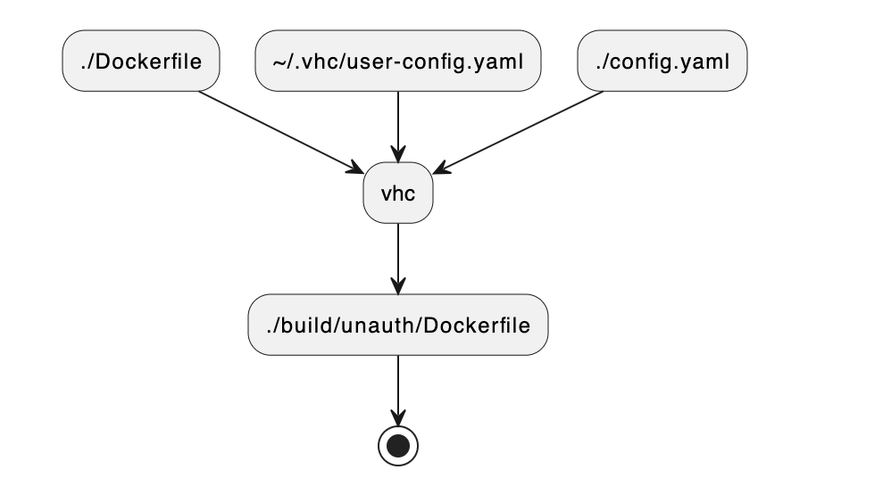

# Template Build

## Image Build Steps

The process of generating an image archive that can be loaded onto a VeeaHub has several steps (show below).



### Generating an Annotated Dockerfile

The first step is to generate an Annotated Dockerfile. This is a Dockerfile that has labels that can be used by Secure Docker to ensure that the image is allowed to run, and to specify all of the devices, features, and services that are used by the image.

The Annotated Dockerfile is created using several configuration files (shown below)


The command to generate an Annotated Dockerfile for an unauthorized image is

```console
$ vhc image build generate --unauth
Generating: /home/joeuser/vh_dbus/build/unauth/Dockerfile
```

!!! warning
    If you don’t have a Partner ID from Veea and you forget to use the `--unauth` flag you will get an error:

    `$ vhc image build generate`  
    `No partner ID found. Please use --unauth.`

All image build output is stored under the `build` directory. Running the `vhc image build distclean` command will delete all build files.

An examination of the Annotated Dockerfile shows the labels described above. These are surrounded by comments warning users not to hand edit the generated Dockerfile.

```console
$ cat build/unauth/Dockerfile 
################################################################################
## Copyright (C) Veea Systems Limited - All Rights Reserved.
## Unauthorised copying of this file, via any medium is strictly prohibited.
## Proprietary and confidential. [2019-2020]
################################################################################

ARG ARCH
FROM $ARCH/alpine:3.9

RUN mkdir /app
COPY src/ /app/
WORKDIR /app

RUN apk update && apk -U --allow-untrusted add python3 py3-gobject3 dumb-init
RUN pip3 install pydbus

ENTRYPOINT ["/usr/bin/dumb-init", "--"]
#BEGIN AUTO-GENERATED - DO NOT EDIT!!!
LABEL com.veea.vhc.architecture="arm32v7"
LABEL com.veea.vhc.version="1.0.0"
LABEL com.veea.vhc.app.name="vh_dbus"
LABEL com.veea.vhc.app.version="1.0.1"
LABEL com.veea.vhc.config.proj.version="3"
LABEL com.veea.vhc.config.user.version="3"
LABEL com.veea.image.persistent_uuid="FFFFFFFF-A180-4F25-B6F9-F9439C533890"
LABEL com.veea.authorisation.allowOnUnauthenticatedHost="true"
LABEL com.veea.authorisation.volumes.persist1="my_volume"
#END AUTO-GENERATED - DO NOT EDIT!!!

CMD ["python3", "-u", "./dbus.py"]
```

### Building the Image

The next step is to build the Docker image using the `vhc image build compile` command. This takes the Annotated Dockerfile and the source code from the `src` directory, and produces a Docker image.

The `compile` command takes an options `--arch` flag, which specifies the target architecture for the build. If you don’t specify an `--arch` flag, then all supported architectures are compile.

You can get a list of VeeaHub platforms and their architectures by running `vhc image config platform list`:

```console
$ vhc image config platform list 
+----------+--------------+----------------+
| PLATFORM | ARCHITECTURE | VEEAHUB MODELS |
+----------+--------------+----------------+
| iesv0.5  | arm32v7      | VHC05          |
| iesv0.9  | arm64v8      | VHE09, VHH09   |
| iesv1.0  | arm64v8      | VHE10, VHH10   |
| iesv2.5  | arm32v7      | VHC25          |
+----------+--------------+----------------+
```

As you can see, all of the platforms run on one of two supported architectures - `arm32v7` and `arm64v8`.

The example below shows how to build the `arm32v7` architecture, which will work on the `iesv0.5` (VHC05) and `iesv2.5` (VHC25) platforms. If you are testing on an `iesv0.9` or `iesv1.0` platform, then you should specify the `arm64v8` architecture.

```console
$ vhc image build compile --arch arm32v7 --unauth
Compiling arm32v7
No need to re-generate Dockerfile....skipping
Compiling image: vh_dbus arm32v7
Removing existing instances of the docker image
docker build  -t vh_dbus-arm32v7:1.0.1 -f /home/joeuser/vh_dbus/build/unauth/arm32v7/Dockerfile /home/joeuser/vh_dbus
Sending build context to Docker daemon  35.33kB
Step 1/17 : ARG ARCH
Step 2/17 : FROM $ARCH/alpine:3.9
 ---> 9df0ff5446fc
Step 3/17 : RUN mkdir /app
 ---> Using cache
 ---> 95b85f7fe12f
Step 4/17 : COPY src/ /app/
 ---> Using cache
 ---> 53337e6fa403
Step 5/17 : WORKDIR /app
 ---> Using cache
 ---> d0cf5cb5441d
Step 6/17 : RUN apk update && apk -U --allow-untrusted add python3 py3-gobject3 dumb-init
 ---> [Warning] The requested image's platform (linux/arm) does not match the detected host platform (linux/amd64) and no specific platform was requested
 ---> Running in 76f0728b196d
fetch http://dl-cdn.alpinelinux.org/alpine/v3.9/main/armv7/APKINDEX.tar.gz
fetch http://dl-cdn.alpinelinux.org/alpine/v3.9/community/armv7/APKINDEX.tar.gz
v3.9.6-143-ga5f34edab6 [http://dl-cdn.alpinelinux.org/alpine/v3.9/main]
v3.9.6-138-ge069a77b3b [http://dl-cdn.alpinelinux.org/alpine/v3.9/community]
OK: 9565 distinct packages available
(1/35) Installing dumb-init (1.2.2-r1)
(2/35) Installing libxau (1.0.8-r3)
(3/35) Installing libbsd (0.8.6-r2)
(4/35) Installing libxdmcp (1.1.2-r5)
(5/35) Installing libxcb (1.13-r2)
(6/35) Installing libx11 (1.6.12-r0)
(7/35) Installing libxext (1.3.3-r3)
(8/35) Installing libxrender (0.9.10-r3)
(9/35) Installing libgcc (8.3.0-r0)
(10/35) Installing expat (2.2.8-r0)
(11/35) Installing libbz2 (1.0.6-r7)
(12/35) Installing libpng (1.6.37-r0)
(13/35) Installing freetype (2.9.1-r3)
(14/35) Installing libuuid (2.33-r0)
(15/35) Installing fontconfig (2.13.1-r0)
(16/35) Installing pixman (0.34.0-r6)
(17/35) Installing cairo (1.16.0-r1)
(18/35) Installing libffi (3.2.1-r6)
(19/35) Installing gdbm (1.13-r1)
(20/35) Installing xz-libs (5.2.4-r0)
(21/35) Installing ncurses-terminfo-base (6.1_p20190105-r0)
(22/35) Installing ncurses-terminfo (6.1_p20190105-r0)
(23/35) Installing ncurses-libs (6.1_p20190105-r0)
(24/35) Installing readline (7.0.003-r1)
(25/35) Installing sqlite-libs (3.28.0-r3)
(26/35) Installing python3 (3.6.9-r3)
(27/35) Installing py3-cairo (1.16.3-r0)
(28/35) Installing libintl (0.19.8.1-r4)
(29/35) Installing libblkid (2.33-r0)
(30/35) Installing libmount (2.33-r0)
(31/35) Installing pcre (8.42-r2)
(32/35) Installing glib (2.58.1-r3)
(33/35) Installing cairo-gobject (1.16.0-r1)
(34/35) Installing gobject-introspection (1.56.1-r0)
(35/35) Installing py3-gobject3 (3.28.2-r0)
Executing busybox-1.29.3-r10.trigger
Executing glib-2.58.1-r3.trigger
OK: 75 MiB in 49 packages
Removing intermediate container 76f0728b196d
 ---> 65e51c10ea0b
Step 7/17 : RUN pip3 install pydbus
 ---> [Warning] The requested image's platform (linux/arm) does not match the detected host platform (linux/amd64) and no specific platform was requested
 ---> Running in f03839a9be74
Collecting pydbus
  Downloading https://files.pythonhosted.org/packages/92/56/27148014c2f85ce70332f18612f921f682395c7d4e91ec103783be4fce00/pydbus-0.6.0-py2.py3-none-any.whl
Installing collected packages: pydbus
Successfully installed pydbus-0.6.0
You are using pip version 18.1, however version 21.3.1 is available.
You should consider upgrading via the 'pip install --upgrade pip' command.
Removing intermediate container f03839a9be74
 ---> 505ed6bba789
Step 8/17 : LABEL com.veea.vhc.architecture="arm32v7"
 ---> [Warning] The requested image's platform (linux/arm) does not match the detected host platform (linux/amd64) and no specific platform was requested
 ---> Running in 576f3083ea4e
Removing intermediate container 576f3083ea4e
 ---> 49d7f920e685
Step 9/17 : LABEL com.veea.vhc.version="1.0.0"
 ---> [Warning] The requested image's platform (linux/arm) does not match the detected host platform (linux/amd64) and no specific platform was requested
 ---> Running in 6f617394866a
Removing intermediate container 6f617394866a
 ---> ca5a083e2a85
Step 10/17 : LABEL com.veea.vhc.app.name="vh_dbus"
 ---> [Warning] The requested image's platform (linux/arm) does not match the detected host platform (linux/amd64) and no specific platform was requested
 ---> Running in c35b48948fb5
Removing intermediate container c35b48948fb5
 ---> 14b92607423f
Step 11/17 : LABEL com.veea.vhc.app.version="1.0.1"
 ---> [Warning] The requested image's platform (linux/arm) does not match the detected host platform (linux/amd64) and no specific platform was requested
 ---> Running in fd4f7e0e2a63
Removing intermediate container fd4f7e0e2a63
 ---> 4f238b49a358
Step 12/17 : LABEL com.veea.vhc.config.proj.version="3"
 ---> [Warning] The requested image's platform (linux/arm) does not match the detected host platform (linux/amd64) and no specific platform was requested
 ---> Running in 357c38e0f2b0
Removing intermediate container 357c38e0f2b0
 ---> bebdc5e28a99
Step 13/17 : LABEL com.veea.vhc.config.user.version="3"
 ---> [Warning] The requested image's platform (linux/arm) does not match the detected host platform (linux/amd64) and no specific platform was requested
 ---> Running in bd17ee283f90
Removing intermediate container bd17ee283f90
 ---> 8c85d90f081a
Step 14/17 : LABEL com.veea.image.persistent_uuid="FFFFFFFF-A180-4F25-B6F9-F9439C533890"
 ---> [Warning] The requested image's platform (linux/arm) does not match the detected host platform (linux/amd64) and no specific platform was requested
 ---> Running in a4722317b7fc
Removing intermediate container a4722317b7fc
 ---> 62f18b3092b4
Step 15/17 : LABEL com.veea.authorisation.allowOnUnauthenticatedHost="true"
 ---> [Warning] The requested image's platform (linux/arm) does not match the detected host platform (linux/amd64) and no specific platform was requested
 ---> Running in 53142d46672b
Removing intermediate container 53142d46672b
 ---> b36cec8cb601
Step 16/17 : LABEL com.veea.authorisation.volumes.persist1="my_volume"
 ---> [Warning] The requested image's platform (linux/arm) does not match the detected host platform (linux/amd64) and no specific platform was requested
 ---> Running in 0cf3df898718
Removing intermediate container 0cf3df898718
 ---> efd07f7235cf
Step 17/17 : CMD ["python3", "./dbus.py"]
 ---> [Warning] The requested image's platform (linux/arm) does not match the detected host platform (linux/amd64) and no specific platform was requested
 ---> Running in 5075b0e680f3
Removing intermediate container 5075b0e680f3
 ---> 38f3b9bd5090
Successfully built 38f3b9bd5090
Successfully tagged vh_dbus-arm32v7:1.0.1
```

The first line of output indicates that `vhc` checked to see if the platform-specific Dockerfile needs to be re-generated. In this case nothing has changes, so this operation is skipped.

!!! warning
    The `vhc` tool will exit with an error If you specify an unknown architecture. For example:

    `$ vhc image build compile --arch arm32v6`  
    `ERROR: Architecture 'arm32v6' is not supported.`

    It will also exit with an error if you specify an architecture that is not supported by the image. For example:

    `$ vhc image build compile --arch arm32v7`  
    `ERROR: Architecture 'arm32v7' is not valid for this image.`

The `compile` operation is very verbose, but ultimately it ends with a tagged build in the local docker registry.

!!! warning
    There are times where a build can fail even if all the configuration is correct. One of the most common is the error shown below:

    `fetch http://dl-cdn.alpinelinux.org/alpine/v3.9/community/aarch64/APKINDEX.tar.gz`  
    `ERROR: http://dl-cdn.alpinelinux.org/alpine/v3.9/community: temporary error (try again later)`  
    `WARNING: Ignoring APKINDEX.737f7e01.tar.gz: No such file or directory`

    The solution is to restart docker using:

    `$ sudo service docker restart`

The success of the build can be verified by running `vhc image build list`

```console
$ vhc image build list
vh_dbus-arm32v7                   1.0.1        38f3b9bd5090   29 minutes ago   64.4MB
```

### Saving the Image Archive

The `compile` operation will build the Docker image, but to run it on a VeeaHub you need an image archive file. An archive file is created by using the `docker image build save` command:

```console
$ vhc image build save --arch arm32v7 --unauth
Saving arm32v7
No need to re-generate Dockerfile....skipping
No need to re-compile image..........skipping
Saving: vh_dbus arm32v7
  Writing vh_dbus-arm32v7:1.0.1.unsigned.tar
```

As you can see, `vhc` checks to see if the previous steps need to be re-run, but decides that they can be skipped because nothing has changed.

The result of this command is an image archive in `build/unauth/arm32v7`.

### Anatomy of a Docker Image

If we examine the resulting Docker image archive using `tar`, we see something like this:

```console
$ tar tf build/auth/arm32v7/vh_dbus-arm32v7\:1.0.1.unsigned.tar 
0210b47d3c8e0acc7e002c309c642b3974b6e226b058a305b54d424d457a8bf5.json
1946968c77adeba4d6b1ee4678b97186e2d0b175f09d2e075c8bf2cf8b230820/
1946968c77adeba4d6b1ee4678b97186e2d0b175f09d2e075c8bf2cf8b230820/VERSION
1946968c77adeba4d6b1ee4678b97186e2d0b175f09d2e075c8bf2cf8b230820/json
1946968c77adeba4d6b1ee4678b97186e2d0b175f09d2e075c8bf2cf8b230820/layer.tar
61e213599c1e18809289c9a332f9e9243e73d1ce12c3fbd1cdca577857956a54/
61e213599c1e18809289c9a332f9e9243e73d1ce12c3fbd1cdca577857956a54/VERSION
61e213599c1e18809289c9a332f9e9243e73d1ce12c3fbd1cdca577857956a54/json
61e213599c1e18809289c9a332f9e9243e73d1ce12c3fbd1cdca577857956a54/layer.tar
804d7f8ea0114c0fbaeb3e3d2d0824c333d38d3fdc478b42778bc0d633ff29ba/
804d7f8ea0114c0fbaeb3e3d2d0824c333d38d3fdc478b42778bc0d633ff29ba/VERSION
804d7f8ea0114c0fbaeb3e3d2d0824c333d38d3fdc478b42778bc0d633ff29ba/json
804d7f8ea0114c0fbaeb3e3d2d0824c333d38d3fdc478b42778bc0d633ff29ba/layer.tar
8549f7348999d1bce37276bc959c57b1a1762ec0e73d54ebe695a1ac187a2b2d/
8549f7348999d1bce37276bc959c57b1a1762ec0e73d54ebe695a1ac187a2b2d/VERSION
8549f7348999d1bce37276bc959c57b1a1762ec0e73d54ebe695a1ac187a2b2d/json
8549f7348999d1bce37276bc959c57b1a1762ec0e73d54ebe695a1ac187a2b2d/layer.tar
b661cdebef65c35161da9293086df8af64b119249d80fd2f025bb98e0811be2b/
b661cdebef65c35161da9293086df8af64b119249d80fd2f025bb98e0811be2b/VERSION
b661cdebef65c35161da9293086df8af64b119249d80fd2f025bb98e0811be2b/json
b661cdebef65c35161da9293086df8af64b119249d80fd2f025bb98e0811be2b/layer.tar
manifest.json
repositories
```

The image archive containers multiple layers along with a `manifest.json`file and a `repositories` file.

The manifest.json file contains information about the image, including the tagged name:

```console
$ jq . manifest.json 
[
  {
    "Config": "0210b47d3c8e0acc7e002c309c642b3974b6e226b058a305b54d424d457a8bf5.json",
    "RepoTags": [
      "vh_dbus-arm32v7:1.0.1"
    ],
    "Layers": [
      "8549f7348999d1bce37276bc959c57b1a1762ec0e73d54ebe695a1ac187a2b2d/layer.tar",
      "1946968c77adeba4d6b1ee4678b97186e2d0b175f09d2e075c8bf2cf8b230820/layer.tar",
      "804d7f8ea0114c0fbaeb3e3d2d0824c333d38d3fdc478b42778bc0d633ff29ba/layer.tar",
      "b661cdebef65c35161da9293086df8af64b119249d80fd2f025bb98e0811be2b/layer.tar",
      "61e213599c1e18809289c9a332f9e9243e73d1ce12c3fbd1cdca577857956a54/layer.tar"
    ]
  }
]
```

The repositories file containers the name and the first layer:

```console
$ cat repositories 
{"vh_dbus-arm32v7":{"1.0.1":"61e213599c1e18809289c9a332f9e9243e73d1ce12c3fbd1cdca577857956a54"}}
```

It’s not important to have an in-depth knowledge of the contents of the image archive, but a basic understanding will help to understand what is added when images are signed and released.

## Eliminating Build Steps

The three steps of generating a Dockerfile, building an image, and saving an image archive can be accomplished skipping straight to the `docker image build save` command. The `vhc` utility is smart enough to know if it needs to perform the previous build steps.

If you re-run the save command, you should see the following:

```console
$ vhc image build save --arch arm32v7 --unauth 
Saving arm32v7
No need to re-generate Dockerfile....skipping
No need to re-compile image..........skipping
No need to re-save image archive.....skipping
```

You can force all of the steps to be re-run by using the `--force` flag:

```console
$ vhc image build save --arch arm32v7 --unauth --force
Saving arm32v7
Generating: /home/joeuser/vh_dbus/build/unauth/arm32v7/Dockerfile
Compiling image: vh_dbus arm32v7
Removing existing instances of the docker image
docker build  -t vh_dbus-arm32v7:1.0.1 -f /home/joeuser/vh_dbus/build/unauth/arm32v7/Dockerfile --build-arg ARCH=arm32v7 /home/joeuser/vh_dbus
Sending build context to Docker daemon  35.33kB
Step 1/17 : ARG ARCH
Step 2/17 : FROM $ARCH/alpine:3.9
 ---> 9df0ff5446fc
Step 3/17 : RUN mkdir /app
 ---> Using cache
 ---> cd3a5f1a6dcd
Step 4/17 : COPY src/ /app/
 ---> Using cache
 ---> 239df44f06a1
Step 5/17 : WORKDIR /app
 ---> Using cache
 ---> ad5cbbb5d3a3
Step 6/17 : RUN apk update && apk -U --allow-untrusted add python3 py3-gobject3 dumb-init
 ---> Using cache
 ---> 5e2431db5f9f
Step 7/17 : RUN pip3 install pydbus
 ---> Using cache
 ---> 5708707bd504
Step 8/17 : LABEL com.veea.vhc.architecture="arm32v7"
 ---> Using cache
 ---> 881b42a77679
Step 9/17 : LABEL com.veea.vhc.version="1.0.0"
 ---> [Warning] The requested image's platform (linux/arm) does not match the detected host platform (linux/amd64) and no specific platform was requested
 ---> Running in 5a32cb835adf
Removing intermediate container 5a32cb835adf
 ---> 425cd05984f6
Step 10/17 : LABEL com.veea.vhc.app.name="vh_dbus"
 ---> [Warning] The requested image's platform (linux/arm) does not match the detected host platform (linux/amd64) and no specific platform was requested
 ---> Running in ed3cc0b94a2b
Removing intermediate container ed3cc0b94a2b
 ---> f52e6f4a835e
Step 11/17 : LABEL com.veea.vhc.app.version="1.0.1"
 ---> [Warning] The requested image's platform (linux/arm) does not match the detected host platform (linux/amd64) and no specific platform was requested
 ---> Running in ba812800ce5f
Removing intermediate container ba812800ce5f
 ---> 7e278ae869cc
Step 12/17 : LABEL com.veea.vhc.config.proj.version="3"
 ---> [Warning] The requested image's platform (linux/arm) does not match the detected host platform (linux/amd64) and no specific platform was requested
 ---> Running in 3031c3d56ff3
Removing intermediate container 3031c3d56ff3
 ---> 413065738d10
Step 13/17 : LABEL com.veea.vhc.config.user.version="3"
 ---> [Warning] The requested image's platform (linux/arm) does not match the detected host platform (linux/amd64) and no specific platform was requested
 ---> Running in f8ab7aa493cb
Removing intermediate container f8ab7aa493cb
 ---> 99bf95b3f361
Step 14/17 : LABEL com.veea.image.persistent_uuid="FFFFFFFF-A180-4F25-B6F9-F9439C533890"
 ---> [Warning] The requested image's platform (linux/arm) does not match the detected host platform (linux/amd64) and no specific platform was requested
 ---> Running in d863feb8b5dc
Removing intermediate container d863feb8b5dc
 ---> 2a8fb73fde58
Step 15/17 : LABEL com.veea.authorisation.allowOnUnauthenticatedHost="true"
 ---> [Warning] The requested image's platform (linux/arm) does not match the detected host platform (linux/amd64) and no specific platform was requested
 ---> Running in 966d28a56251
Removing intermediate container 966d28a56251
 ---> a01e597a0eb6
Step 16/17 : LABEL com.veea.authorisation.volumes.persist1="my_volume"
 ---> [Warning] The requested image's platform (linux/arm) does not match the detected host platform (linux/amd64) and no specific platform was requested
 ---> Running in b2f07905345c
Removing intermediate container b2f07905345c
 ---> 33ec1f155c23
Step 17/17 : CMD ["python3", "./dbus.py"]
 ---> [Warning] The requested image's platform (linux/arm) does not match the detected host platform (linux/amd64) and no specific platform was requested
 ---> Running in 489113b0822d
Removing intermediate container 489113b0822d
 ---> 24369bc5202b
Successfully built 24369bc5202b
Successfully tagged vh_dbus-arm32v7:1.0.1
Saving: vh_dbus arm32v7
  Writing vh_dbus-arm32v7:1.0.1.unsigned.tar
```

You’ll notice that the Docker build was much faster this time. This is because nothing changed in the generated Dockerfile. You force Docker to do a re-build with the `--no-cache` flag:

```console
$ vhc image build save --arch arm32v7  --unauth --force --no-cache
Saving arm32v7
Generating: /home/joeuser/vh_dbus/build/unauth/arm32v7/Dockerfile
Compiling image: vh_dbus arm32v7
Removing existing instances of the docker image
docker build  --no-cache -t vh_dbus-arm32v7:1.0.1 -f /home/joeuser/vh_dbus/build/unauth/arm32v7/Dockerfile --build-arg ARCH=arm32v7 /home/joeuser/vh_dbus
Sending build context to Docker daemon  69.81MB
Step 1/17 : ARG ARCH
Step 2/17 : FROM $ARCH/alpine:3.9
 ---> 9df0ff5446fc
Step 3/17 : RUN mkdir /app
 ---> [Warning] The requested image's platform (linux/arm) does not match the detected host platform (linux/amd64) and no specific platform was requested
 ---> Running in 84369359f06d
Removing intermediate container 84369359f06d
 ---> bf4f6185f19c
Step 4/17 : COPY src/ /app/
 ---> e8488c85e241
Step 5/17 : WORKDIR /app
 ---> [Warning] The requested image's platform (linux/arm) does not match the detected host platform (linux/amd64) and no specific platform was requested
 ---> Running in a92c648d8a3e
Removing intermediate container a92c648d8a3e
 ---> 7d32d48f5228
Step 6/17 : RUN apk update && apk -U --allow-untrusted add python3 py3-gobject3 dumb-init
 ---> [Warning] The requested image's platform (linux/arm) does not match the detected host platform (linux/amd64) and no specific platform was requested
 ---> Running in 66762795d622
fetch http://dl-cdn.alpinelinux.org/alpine/v3.9/main/armv7/APKINDEX.tar.gz
fetch http://dl-cdn.alpinelinux.org/alpine/v3.9/community/armv7/APKINDEX.tar.gz
v3.9.6-143-ga5f34edab6 [http://dl-cdn.alpinelinux.org/alpine/v3.9/main]
v3.9.6-138-ge069a77b3b [http://dl-cdn.alpinelinux.org/alpine/v3.9/community]
OK: 9565 distinct packages available
(1/35) Installing dumb-init (1.2.2-r1)
(2/35) Installing libxau (1.0.8-r3)
(3/35) Installing libbsd (0.8.6-r2)
(4/35) Installing libxdmcp (1.1.2-r5)
(5/35) Installing libxcb (1.13-r2)
(6/35) Installing libx11 (1.6.12-r0)
(7/35) Installing libxext (1.3.3-r3)
(8/35) Installing libxrender (0.9.10-r3)
(9/35) Installing libgcc (8.3.0-r0)
(10/35) Installing expat (2.2.8-r0)
(11/35) Installing libbz2 (1.0.6-r7)
(12/35) Installing libpng (1.6.37-r0)
(13/35) Installing freetype (2.9.1-r3)
(14/35) Installing libuuid (2.33-r0)
(15/35) Installing fontconfig (2.13.1-r0)
(16/35) Installing pixman (0.34.0-r6)
(17/35) Installing cairo (1.16.0-r1)
(18/35) Installing libffi (3.2.1-r6)
(19/35) Installing gdbm (1.13-r1)
(20/35) Installing xz-libs (5.2.4-r0)
(21/35) Installing ncurses-terminfo-base (6.1_p20190105-r0)
(22/35) Installing ncurses-terminfo (6.1_p20190105-r0)
(23/35) Installing ncurses-libs (6.1_p20190105-r0)
(24/35) Installing readline (7.0.003-r1)
(25/35) Installing sqlite-libs (3.28.0-r3)
(26/35) Installing python3 (3.6.9-r3)
(27/35) Installing py3-cairo (1.16.3-r0)
(28/35) Installing libintl (0.19.8.1-r4)
(29/35) Installing libblkid (2.33-r0)
(30/35) Installing libmount (2.33-r0)
(31/35) Installing pcre (8.42-r2)
(32/35) Installing glib (2.58.1-r3)
(33/35) Installing cairo-gobject (1.16.0-r1)
(34/35) Installing gobject-introspection (1.56.1-r0)
(35/35) Installing py3-gobject3 (3.28.2-r0)
Executing busybox-1.29.3-r10.trigger
Executing glib-2.58.1-r3.trigger
OK: 75 MiB in 49 packages
Removing intermediate container 66762795d622
 ---> 454e9491f213
Step 7/17 : RUN pip3 install pydbus
 ---> [Warning] The requested image's platform (linux/arm) does not match the detected host platform (linux/amd64) and no specific platform was requested
 ---> Running in 5304366fa37a
Collecting pydbus
  Downloading https://files.pythonhosted.org/packages/92/56/27148014c2f85ce70332f18612f921f682395c7d4e91ec103783be4fce00/pydbus-0.6.0-py2.py3-none-any.whl
Installing collected packages: pydbus
Successfully installed pydbus-0.6.0
You are using pip version 18.1, however version 21.3.1 is available.
You should consider upgrading via the 'pip install --upgrade pip' command.
Removing intermediate container 5304366fa37a
 ---> 32714cd9cf68
Step 8/17 : LABEL com.veea.vhc.architecture="arm32v7"
 ---> [Warning] The requested image's platform (linux/arm) does not match the detected host platform (linux/amd64) and no specific platform was requested
 ---> Running in b9de27409795
Removing intermediate container b9de27409795
 ---> 70bad0762c76
Step 9/17 : LABEL com.veea.vhc.version="1.0.0"
 ---> [Warning] The requested image's platform (linux/arm) does not match the detected host platform (linux/amd64) and no specific platform was requested
 ---> Running in 1d9241be6abe
Removing intermediate container 1d9241be6abe
 ---> bf3b36a892b3
Step 10/17 : LABEL com.veea.vhc.app.name="vh_dbus"
 ---> [Warning] The requested image's platform (linux/arm) does not match the detected host platform (linux/amd64) and no specific platform was requested
 ---> Running in 9383d37b92c8
Removing intermediate container 9383d37b92c8
 ---> c1d8df7fd3b8
Step 11/17 : LABEL com.veea.vhc.app.version="1.0.1"
 ---> [Warning] The requested image's platform (linux/arm) does not match the detected host platform (linux/amd64) and no specific platform was requested
 ---> Running in c50b6df3ced2
Removing intermediate container c50b6df3ced2
 ---> 033de004b156
Step 12/17 : LABEL com.veea.vhc.config.proj.version="3"
 ---> [Warning] The requested image's platform (linux/arm) does not match the detected host platform (linux/amd64) and no specific platform was requested
 ---> Running in a1634040927c
Removing intermediate container a1634040927c
 ---> 72f1520ae9d4
Step 13/17 : LABEL com.veea.vhc.config.user.version="3"
 ---> [Warning] The requested image's platform (linux/arm) does not match the detected host platform (linux/amd64) and no specific platform was requested
 ---> Running in 62ea7ec9e7d0
Removing intermediate container 62ea7ec9e7d0
 ---> 9af9301d1bc8
Step 14/17 : LABEL com.veea.image.persistent_uuid="FFFFFFFF-A180-4F25-B6F9-F9439C533890"
 ---> [Warning] The requested image's platform (linux/arm) does not match the detected host platform (linux/amd64) and no specific platform was requested
 ---> Running in 2c689da218bb
Removing intermediate container 2c689da218bb
 ---> 66d898ec7c77
Step 15/17 : LABEL com.veea.authorisation.allowOnUnauthenticatedHost="true"
 ---> [Warning] The requested image's platform (linux/arm) does not match the detected host platform (linux/amd64) and no specific platform was requested
 ---> Running in b07fe4c81e38
Removing intermediate container b07fe4c81e38
 ---> 198b06221cc0
Step 16/17 : LABEL com.veea.authorisation.volumes.persist1="my_volume"
 ---> [Warning] The requested image's platform (linux/arm) does not match the detected host platform (linux/amd64) and no specific platform was requested
 ---> Running in a9b646769be2
Removing intermediate container a9b646769be2
 ---> 31fee037dee0
Step 17/17 : CMD ["python3", "./dbus.py"]
 ---> [Warning] The requested image's platform (linux/arm) does not match the detected host platform (linux/amd64) and no specific platform was requested
 ---> Running in 2ecc4e4cde15
Removing intermediate container 2ecc4e4cde15
 ---> 3554d040cc99
Successfully built 3554d040cc99
Successfully tagged vh_dbus-arm32v7:1.0.1
Saving: vh_dbus arm32v7
  Writing vh_dbus-arm32v7:1.0.1.unsigned.tar
```

You can also specify custom build flags to be passed to Docker during the build. We’ll talk about this more in the advanced sections, but you can run `vhc image build --help` to see all of the build flags.
