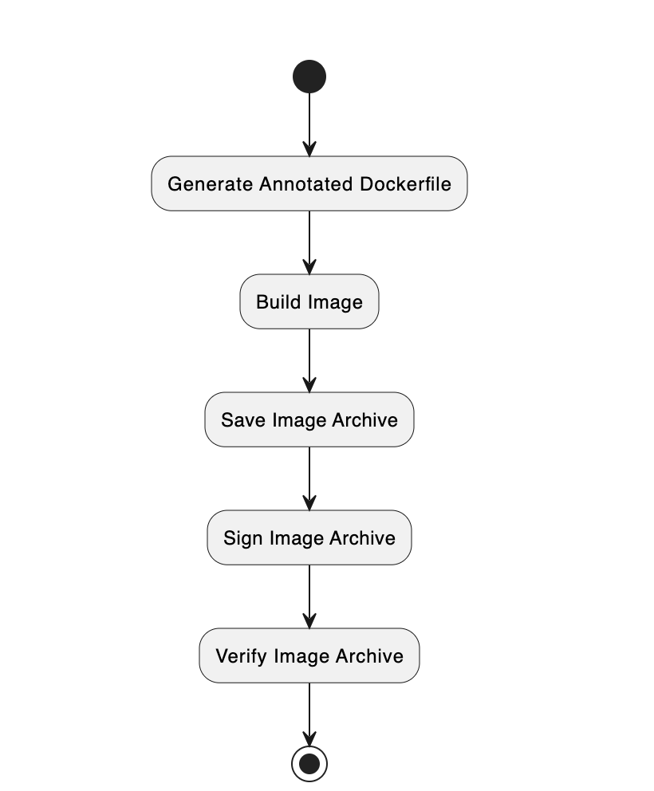

# A Simple Signed Image Example

## Building a Signed Image

Once you have the credentials, you can proceed to building a signed image. This is done using the `vhc image build sign` command.

Similar to building an unauthorized image, there are several steps involved in building a signed image. These are show below.


The `vhc image build sign` command will run through each of the steps in order.

```console
$ vhc image build sign --arch arm32v7
Signing arm32v7
Generating: /home/joeuser/vh_dbus/build/auth/Dockerfile
/home/joeuser/vh_dbus/build/auth/Dockerfile is newer than the vh_dbus-arm32v7:1.0.1 docker image.
Compiling image: vh_dbus arm32v7
docker build  --build-arg ARCH=arm32v7 --build-arg GOARCH=arm -t vh_dbus-arm32v7:1.0.1 -f /home/joeuser/vh_dbus/build/auth/Dockerfile /home/joeuser/vh_dbus
Sending build context to Docker daemon  39.42kB
Step 1/22 : ARG ARCH
Step 2/22 : FROM $ARCH/alpine:3.9
 ---> 9df0ff5446fc
Step 3/22 : RUN mkdir /app
 ---> Using cache
 ---> b1ee2a4911f6
Step 4/22 : COPY src/ /app/
 ---> Using cache
 ---> 33c84b66af98
Step 5/22 : WORKDIR /app
 ---> Using cache
 ---> dd97531f228d
Step 6/22 : RUN apk update && apk -U --allow-untrusted add python3 py3-gobject3 dumb-init
 ---> Using cache
 ---> 57a66444855e
Step 7/22 : RUN pip3 install pydbus
 ---> Using cache
 ---> 09eaabecc132
Step 8/22 : ARG ARCH
 ---> Using cache
 ---> 1b770b71cbee
Step 9/22 : LABEL com.veea.vhc.architecture="$ARCH"
 ---> Using cache
 ---> e94d3389472e
Step 10/22 : LABEL com.veea.vhc.version="0.9.3-25-2-g6d83c6a-dirty"
 ---> Using cache
 ---> 6a76c95134a9
Step 11/22 : LABEL com.veea.vhc.app.name="vh_dbus"
 ---> Using cache
 ---> 55ac938e5f5b
Step 12/22 : LABEL com.veea.vhc.app.version="1.0.1"
 ---> Using cache
 ---> 3abe2c730aba
Step 13/22 : LABEL com.veea.vhc.config.proj.version="3"
 ---> Using cache
 ---> 0e7460c04434
Step 14/22 : LABEL com.veea.vhc.config.user.version="3"
 ---> Using cache
 ---> 78e53b577670
Step 15/22 : LABEL com.veea.authentication.identifier="PARTNER;00000033;1632209646,1947569646;k5B6h9FPRSv7RgEJP1lBb40MfAejcFI48ju3wmnnOng=;sha256;veeahub_license_server;MEUCIFmgzx1aJYu9gmqOFEUgKICGTKL+2/yUY9ocp3bFWhVgAiEAtrlOf6Ke/yGzVyMF9uOPajhG9Qf2SN/KB8hYxv5r9bQ="
 ---> Using cache
 ---> 2257df1e400b
Step 16/22 : LABEL com.veea.image.persistent_uuid="00000033-A180-4F25-B6F9-F9439C533890"
 ---> Using cache
 ---> bd9f1eb6d8fb
Step 17/22 : LABEL com.veea.authorisation.allowOnUnauthenticatedHost="true"
 ---> Using cache
 ---> d90a85752838
Step 18/22 : LABEL com.veea.authentication.certificates.partner="MIICHDCCAcKgAwIBAgIJAItFm370meWPMAoGCCqGSM49BAMCMEcxETAPBgNVBAoMCFZlZWEgSW5jMTIwMAYDVQQDDClWZWVhIFBhcnRuZXIgMDAwMDAwMzMgU2lnbmluZyBDZXJ0aWZpY2F0ZTAeFw0yMTA5MjEwNzM0MDZaFw0zMTA5MTkwNzM0MDZaMEcxETAPBgNVBAoMCFZlZWEgSW5jMTIwMAYDVQQDDClWZWVhIFBhcnRuZXIgMDAwMDAwMzMgU2lnbmluZyBDZXJ0aWZpY2F0ZTBZMBMGByqGSM49AgEGCCqGSM49AwEHA0IABE+MWTLrVyhEZppqGil0RYU5Uks3lNROqepxDAeXeXqDSpO9YM0gMJXoDtjzJlDkBjPbkIU2ceGG3Z7m8Sx1/l6jgZYwgZMwYQYDVR0jBFowWKFLpEkwRzERMA8GA1UECgwIVmVlYSBJbmMxMjAwBgNVBAMMKVZlZWEgUGFydG5lciAwMDAwMDAzMyBTaWduaW5nIENlcnRpZmljYXRlggkAi0WbfvSZ5Y8wHQYDVR0OBBYEFMBWFw/tkOSeF9DpgJvAVAGaQIO6MA8GA1UdEwEB/wQFMAMBAf8wCgYIKoZIzj0EAwIDSAAwRQIgK5IpAsX9vjBFS7vBw6/f+CsBhT5KABf7MNZpcatFDUECIQDTzvmbg9tr3pKeW6upz1ZTmbepPUjq0vlq2LTm5IK6PQ=="
 ---> Using cache
 ---> 2ce555b3b60a
Step 19/22 : LABEL com.veea.authentication.certificates.veeahub_license_server="MIIB0jCCATSgAwIBAgIBATAKBggqhkjOPQQDAjBAMREwDwYDVQQKDAhWZWVhIEluYzEfMB0GA1UEAwwWVmVlYSBMaWNlbnNlIEF1dGhvcml0eTEKMAgGA1UELAwBMDAeFw0xODEyMDcxODE3NTlaFw0zMzEyMDMxODE3NTlaMEIxETAPBgNVBAoMCFZlZWEgSW5jMSEwHwYDVQQDDBhWZWVhIE1haW4gTGljZW5zZSBTZXJ2ZXIxCjAIBgNVBCwMATAwWTATBgcqhkjOPQIBBggqhkjOPQMBBwNCAAQqVnzlrPYomV3ZRVZaGxRv4xJPhKnkNa+PALfw8Xc/MemlcoLZmAKWWNRPjIyW2sOlYKr0+FpGIvZVZ4u/6iAFox0wGzAMBgNVHRMBAf8EAjAAMAsGA1UdDwQEAwICtDAKBggqhkjOPQQDAgOBiwAwgYcCQgCXFl2jBWtVp7H6ELCxLUs0tl4wFycLW4ANoKErrTcmv8TxlcsD0lUq6iBPQAmtlUW00QeVwNG2Ffavvli6Cvq+0AJBT8R4+UMqL6PKs2Dle3S6LwyEjmtAYwLv685LwPOTMzR4FiQoUmT1DVnR9rjudO18p5Uqzufwr3SABYv0FFtpVvM="
 ---> Using cache
 ---> 2bd267ca251e
Step 20/22 : LABEL com.veea.authentication.certificates.veeahub_license_authority="MIICJDCCAYagAwIBAgIBBDAKBggqhkjOPQQDAjBLMQowCAYDVQQsDAEwMREwDwYDVQQKDAhWZWVhIEluYzEMMAoGA1UECwwDUEtJMRwwGgYDVQQDDBNWZWVhIFJvb3QgQXV0aG9yaXR5MB4XDTE4MTIwNzE4MTI1NVoXDTM4MTIwMjE4MTI1NVowQDERMA8GA1UECgwIVmVlYSBJbmMxHzAdBgNVBAMMFlZlZWEgTGljZW5zZSBBdXRob3JpdHkxCjAIBgNVBCwMATAwgZswEAYHKoZIzj0CAQYFK4EEACMDgYYABAE2fGY0fpdvS1moPN/3iTc5F9mTnEYtFeyj325dNpcT9OJPfYx/ORV0dMXY7OLXN87+0pR0a6gOnIAj5Ozlw0xBoQAyuPxDdmWKVAzg9g2+d01JqDQRyHUZdDzdtlGMh0JRvX2RHgtB+3jVvMVmzNdxmjJP0lsoJC26Io3K4WKjB+wNz6MjMCEwEgYDVR0TAQH/BAgwBgEB/wIBADALBgNVHQ8EBAMCAoQwCgYIKoZIzj0EAwIDgYsAMIGHAkEWk3a6EgOknqIQbDSoIGtczfq7LNmPegHyKg7WEodpT0PnRhB/pXctWOPA3k0i1BSuPCCa+5mKGhjTxDaUVbNNUwJCAYHfHkIaEkMeceloA7NmB85XBY6+ftnBEumzPth5C5QQ3RyoU4ktZ8A8PYjDbGGYD8l7V5Jl5yUd1w7Nl7Budqyf"
 ---> Using cache
 ---> b71b2f193382
Step 21/22 : ENTRYPOINT ["/usr/bin/dumb-init", "--"]
 ---> Using cache
 ---> e79a7e854ada
Step 22/22 : CMD ["python3", "-u", "./dbus.py"]
 ---> Using cache
 ---> 51da53a00e7a
[Warning] One or more build-args [GOARCH] were not consumed
Successfully built 51da53a00e7a
Successfully tagged vh_dbus-arm32v7:1.0.1
Pruning any dangling instances of the same image
Saving: vh_dbus arm32v7
  Writing vh_dbus-arm32v7:1.0.1.unsigned.tar
Signing: vh_dbus arm32v7
  Enter Keycloak Username [joe@developer.com]:
  Enter Keycloak Password: 
[--project /home/joeuser/vh_dbus/build/auth/arm32v7 --userconfig /home/joeuser/.vhc/user-config.yaml --sign --repo vh_dbus-arm32v7:1.0.1 --image /home/joeuser/vh_dbus/build/auth/arm32v7/vh_dbus-arm32v7:1.0.1.signed.tar]
  Processing: vh_dbus-arm32v7:1.0.1
    Docker TAG:      vh_dbus-arm32v7:1.0.1
    Feature Set:     /opt/veea/vht/bin/config/features.json
    Rule Set:        /opt/veea/vht/bin/config/verify.json
    Working folder:  /tmp/tmp5rux9e0h
    Signing Server   https://signing.veea.co/
    Signing Key      None
    Signing Cert     None
    Partner Cert     /home/joeuser/.vhc/veea-partner-00000033-cert.pem
    OpenSSL Arguments:
      -engine=pkcs11
      -keyform=engine
  Verifying unsigned image
  Signing unsigned image
    Writing /home/joeuser/vh_dbus/build/auth/arm32v7/vh_dbus-arm32v7:1.0.1.signed.tar
Verifying: vh_dbus arm32v7
  Verifying signed image
```

If you look at the Annotated Dockerfile, you can observe that additional labels were added for licenses. You should see labels for

*   com.veea.authentication.identifier
    
*   com.veea.authentication.certificates.partner
    
*   com.veea.authentication.certificates.veeahub_license_server
    
*   com.veea.authentication.certificates.veeahub_license_authority
    

```console
$ cat build/auth/Dockerfile 
################################################################################
## Copyright (C) Veea Systems Limited - All Rights Reserved.
## Unauthorised copying of this file, via any medium is strictly prohibited.
## Proprietary and confidential. [2019-2020]
################################################################################

ARG ARCH
FROM $ARCH/alpine:3.9

RUN mkdir /app
COPY src/ /app/
WORKDIR /app

RUN apk update && apk -U --allow-untrusted add python3 py3-gobject3 dumb-init
RUN pip3 install pydbus

#BEGIN AUTO-GENERATED - DO NOT EDIT!!!
ARG ARCH
LABEL com.veea.vhc.architecture="$ARCH"
LABEL com.veea.vhc.version="1.0.0"
LABEL com.veea.vhc.app.name="vh_dbus"
LABEL com.veea.vhc.app.version="1.0.1"
LABEL com.veea.vhc.config.proj.version="3"
LABEL com.veea.vhc.config.user.version="3"
LABEL com.veea.authentication.identifier="PARTNER;00000033;1632209646,1947569646;k5B6h9FPRSv7RgEJP1lBb40MfAejcFI48ju3wmnnOng=;sha256;veeahub_license_server;<redacted>"
LABEL com.veea.image.persistent_uuid="00000033-A180-4F25-B6F9-F9439C533890"
LABEL com.veea.authorisation.allowOnUnauthenticatedHost="true"
LABEL com.veea.authentication.certificates.partner="<redacted>"
LABEL com.veea.authentication.certificates.veeahub_license_server="<redacted>"
LABEL com.veea.authentication.certificates.veeahub_license_authority="<redacted>"
#END AUTO-GENERATED - DO NOT EDIT!!!

ENTRYPOINT ["/usr/bin/dumb-init", "--"]
CMD ["python3", "-u", "./dbus.py"]
```

Portions of the licenses and certificates have been redacted for security and readability.

## Anatomy of a Signed Image Archive

The signed image archive contents are almost identical to the unsigned image archive. Looking at the manifest.json file, we see the same layers, but a different Config JSON file with the extra labels:

```console
$ jq . manifest.json 
[
  {
    "Config": "0210b47d3c8e0acc7e002c309c642b3974b6e226b058a305b54d424d457a8bf5.json",
    "RepoTags": [
      "vh_dbus-arm32v7:1.0.1"
    ],
    "Layers": [
      "8549f7348999d1bce37276bc959c57b1a1762ec0e73d54ebe695a1ac187a2b2d/layer.tar",
      "1946968c77adeba4d6b1ee4678b97186e2d0b175f09d2e075c8bf2cf8b230820/layer.tar",
      "804d7f8ea0114c0fbaeb3e3d2d0824c333d38d3fdc478b42778bc0d633ff29ba/layer.tar",
      "b661cdebef65c35161da9293086df8af64b119249d80fd2f025bb98e0811be2b/layer.tar",
      "61e213599c1e18809289c9a332f9e9243e73d1ce12c3fbd1cdca577857956a54/layer.tar"
    ]
  }
]
```

It is only when an image is released that additional meta-data is added to the archive. This will be discussed in the tutorial on building and releasing applications.

## Upload the Signed Image

```console
$ vhc hub access upload-image build/auth/arm32v7/vh_dbus-arm32v7\:1.0.1.signed.tar 
Creating image push for file [build/auth/arm32v7/vh_dbus-arm32v7:1.0.1.signed.tar] on C25CTW00000000001567:9000 (images/push)...
##################################################################################################################################### 100.0%
```

## Running the Signed Image

Start the VeeaShell.

```console
$ vhc hub access shell

                  **      **   ********  **      **
                 /**     /**  **//////  /**     /**
                 /**     /** /**        /**     /**
                 //**    **  /********* /**********
                  //**  **   ////////** /**//////**
                   //****           /** /**     /**
                    //**      ********  /**     /**
                     //      ////////   //      //

    Welcome to the Veea shell.   Type help or ? to list commands.
            
[VHC25000001567-00000033] 
```

You should notice that the Partner ID is displayed as part of the shell prompt. In this example it is `000000333`.

!!! warning
    If you don’t see you Partner ID in the Veea Shell prompt, then you should check that you Partner CMS file has been loaded onto your development VeeaHub using the `vhc hub access upload-license` command.

Create the container.

```text
[VHC25000001567-00000033] docker image create vh_dbus:1.0.0:9c321a2b --detach
611bab6f7ba13c804a2bd77414678d009de240da07c008bf291d3988d55c9672
[VHC25000001567-00000033] 
```

Start the container.

```text
[VHC25000001567-00000033] docker container start vh_dbus:611bab6f
611bab6f7ba13c804a2bd77414678d009de240da07c008bf291d3988d55c9672
[VHC25000001567-00000033] 
```

As with the unauthorized image, you can stream logs and do a container `exec` to get a container shell.
